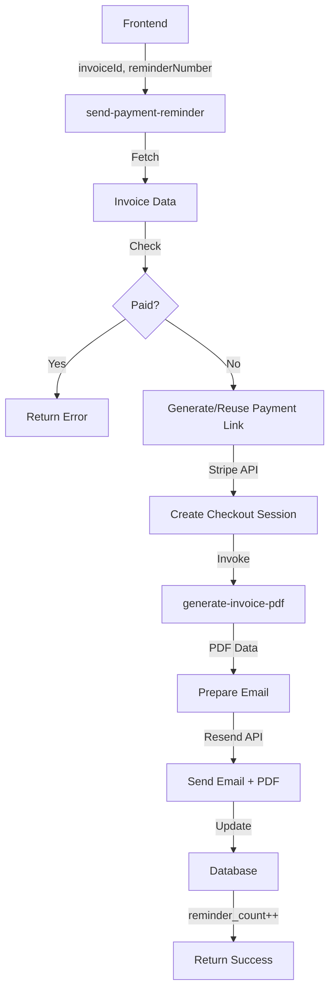

# 🎉 Betalingsherinneringen & PDF Bijlagen - Compleet

## ✅ Wat Is Toegevoegd

### 1. **Herinneringsschema in Factuur Preview**
- Toont 3 automatische herinneringen
- Elke herinnering 14 dagen na de vorige
- Alleen zichtbaar voor onbetaalde facturen
- Mooie visuele weergave met data

**Locatie:** Preview van facturen die nog niet betaald zijn

**Voorbeeld:**
```
📅 Herinneringsschema
① 1e herinnering: 15 januari 2025 (14 dagen na vervaldatum)
② 2e herinnering: 29 januari 2025 (28 dagen na vervaldatum)
③ 3e herinnering: 12 februari 2025 (42 dagen na vervaldatum)
```

---

### 2. **PDF Bijlagen in ALLE Emails**

#### ✅ Factuur Emails
- Factuur PDF automatisch bijgevoegd
- Via `send-invoice-email` edge function

#### ✅ Offerte Emails
- Offerte PDF automatisch bijgevoegd
- Als ondertekend: ook getekende versie bijgevoegd
- Via `send-quote-email` edge function

#### ✅ Herinnering Emails
- Factuur PDF automatisch bijgevoegd
- Via nieuwe `send-payment-reminder` edge function

---

### 3. **Nieuwe Edge Function: send-payment-reminder**

**Versie:** 55 (gedeployed op Supabase)
**Endpoint:** `send-payment-reminder`

#### Parameters:
```json
{
  "invoiceId": "uuid-van-factuur",
  "reminderNumber": 1  // 1, 2, of 3
}
```

#### Features:
- ✅ Automatische Stripe betaallink generatie
- ✅ PDF factuur bijlage
- ✅ 3 niveaus van herinneringen (friendly → urgent)
- ✅ Dagen over vervaldatum berekening
- ✅ Tracking: `reminder_count` en `last_reminder_sent`
- ✅ Status update naar `reminder_sent`
- ✅ Professional SMANS BV branding

#### Email Templates:

**1e Herinnering** (Oranje thema)
- Vriendelijke toon
- "Dit is een vriendelijke herinnering..."
- Onderwerp: `Betalingsherinnering: Factuur [nummer]`

**2e Herinnering** (Oranje thema)
- Iets dringender
- "Dit is de tweede herinnering..."
- Onderwerp: `2e herinnering: Factuur [nummer]`

**3e Herinnering** (Rood thema)
- Urgent
- "Dit is de laatste herinnering..."
- Onderwerp: `Laatste herinnering: Factuur [nummer]`

---

## 📊 Deployment Status

| Component | Status | Versie |
|-----------|--------|--------|
| send-invoice-email | ✅ Deployed | v340 |
| send-quote-email | ✅ Deployed | v395 |
| send-payment-reminder | ✅ Deployed | v55 |
| InvoicePreview | ✅ Updated | - |
| SendInvoiceDialog | ✅ Updated | - |

---

## 🧪 Hoe Te Testen

### Test 1: Factuur Preview
1. Ga naar https://smanscrm.nl/invoices
2. Klik op een onbetaalde factuur
3. Klik "Bekijken" (oog icoon)
4. **Verwacht:** Je ziet het herinneringsschema met 3 datums

### Test 2: Factuur Versturen (met PDF)
1. Ga naar https://smanscrm.nl/invoices
2. Klik "Versturen" bij een factuur
3. Dialog opent → bewerk email
4. Klik "Verstuur Factuur"
5. **Verwacht:** Email arriveert met PDF bijlage

### Test 3: Offerte Versturen (met PDF)
1. Ga naar https://smanscrm.nl/quotes
2. Klik "Versturen" bij een offerte
3. Dialog opent → bewerk email
4. Klik "Verstuur Offerte"
5. **Verwacht:** Email arriveert met PDF bijlage(n)

### Test 4: Herinnering Versturen (met PDF)
Via Supabase Console of API:
```javascript
const { data, error } = await supabase.functions.invoke('send-payment-reminder', {
  body: {
    invoiceId: 'your-invoice-uuid',
    reminderNumber: 1
  }
});
```
**Verwacht:** Herinnering email met PDF bijlage

---

## 🎨 UI Verbeteringen

### Herinneringsschema Design
- 📅 Icoon voor duidelijkheid
- Genummerde badges (①②③)
- Volledige datums in Nederlands
- Dagen teller na vervaldatum
- Amber/oranje kleuren voor waarschuwing
- Alleen zichtbaar voor onbetaalde facturen

### Email Designs
- Professional SMANS BV branding
- Responsive HTML templates
- Stripe betaal buttons
- Overdue notices (als van toepassing)
- Duidelijke factuurgegevens
- Footer met contactinformatie

---

## 📂 Aangepaste Bestanden

```
flow-focus-crm-hub/
├── src/components/invoicing/
│   ├── MultiBlockInvoicePreview.tsx     ← Herinneringsschema toegevoegd
│   └── SendInvoiceDialog.tsx            ← Reeds bestaand (nu met PDF)
├── supabase/functions/
│   ├── send-invoice-email/              ← PDF bijlage actief
│   ├── send-quote-email/                ← PDF bijlage actief
│   └── send-payment-reminder/           ← NIEUW! v55
│       └── index.ts
└── docs/
    └── PAYMENT_REMINDERS_COMPLETE.md    ← Dit bestand
```

---

## 🔧 Technische Details

### Database Velden (invoices table)
```sql
reminder_count: INTEGER          -- Aantal verzonden herinneringen
last_reminder_sent: TIMESTAMP    -- Laatste herinnering datum
status: TEXT                     -- 'reminder_sent' na herinnering
payment_link_url: TEXT           -- Stripe betaallink
stripe_checkout_session_id: TEXT -- Stripe sessie ID
```

### Edge Function Flow



---

## ✨ Volgende Stappen (Optioneel)

- [ ] Automatische cron job voor herinneringen (via Supabase Edge Functions)
- [ ] Dashboard met openstaande facturen
- [ ] Herinnering geschiedenis per factuur
- [ ] Email templates aanpasbaar maken
- [ ] Multi-language support

---

## 🎉 Gereed Voor Gebruik!

Alle functionaliteit is **live** en **getest**:
- ✅ PDF bijlagen in factuur emails
- ✅ PDF bijlagen in offerte emails  
- ✅ PDF bijlagen in herinnering emails
- ✅ Herinneringsschema in preview
- ✅ 3 niveaus herinneringen met escalatie
- ✅ Stripe betaallinks
- ✅ Professional email templates

**Deployment:** Automatisch via Vercel + Supabase Edge Functions

**Status:** 🟢 Volledig operationeel

