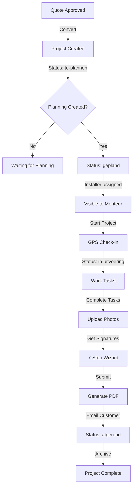

# SMANS CRM - Product Requirements Document (PART 2)

**Version:** 1.0  
**Date:** January 9, 2025  
**Continued from:** [PRD_SMANS_CRM.md](./PRD_SMANS_CRM.md)

---

## 4.4 Invoice System

### 4.4.1 Overview
Complete invoice management with payment tracking and automated PDF generation.

### 4.4.2 Functional Requirements

**FR-INV-001: Invoice Creation**
- Create from completed projects
- Create from quotes
- Create manually
- Auto-populate customer and line items
- Multiple invoice types: Standard, Proforma, Credit Note

**FR-INV-002: Invoice Fields**
Required:
- Invoice number (auto-generated: INV-2025-001)
- Customer
- Invoice date
- Due date (default: +30 days)
- Line items
- Payment terms

Optional:
- Purchase order reference
- Notes
- Payment instructions

**FR-INV-003: Payment Tracking**
- Payment status: Unpaid, Partially Paid, Paid, Overdue
- Payment date tracking
- Payment method tracking
- Payment amount tracking
- Automatic overdue detection

**FR-INV-004: Invoice Status**
- Draft: Being edited
- Sent: Emailed to customer
- Paid: Full payment received
- Partially Paid: Partial payment received
- Overdue: Due date passed, not paid
- Cancelled: Invoice cancelled

**FR-INV-005: Reminders**
- Automatic payment reminders
- 7 days before due date
- On due date
- 7, 14, 30 days after due date

### 4.4.3 Access Control

**IMPORTANT:** Only Administrator and Administratie roles have access to invoices.

| Role | View | Create | Edit | Delete | Payment Tracking |
|------|------|--------|------|--------|------------------|
| Administrator | ✅ | ✅ | ✅ | ✅ | ✅ |
| Administratie | ✅ | ✅ | ✅ | ❌ | ✅ |
| Verkoper | ❌ | ❌ | ❌ | ❌ | ❌ |
| Installateur | ❌ | ❌ | ❌ | ❌ | ❌ |
| Bekijker | ✅ | ❌ | ❌ | ❌ | ❌ |

### 4.4.4 Technical Specifications

**Convex Schema:**
```typescript
invoices: defineTable({
  invoiceNumber: v.string(), // INV-2025-001
  customerId: v.id("customers"),
  projectId: v.optional(v.id("projects")),
  quoteId: v.optional(v.id("quotes")),
  type: v.union(
    v.literal("standard"),
    v.literal("proforma"),
    v.literal("credit_note")
  ),
  status: v.union(
    v.literal("draft"),
    v.literal("sent"),
    v.literal("paid"),
    v.literal("partially_paid"),
    v.literal("overdue"),
    v.literal("cancelled")
  ),
  invoiceDate: v.number(),
  dueDate: v.number(),
  subtotal: v.number(),
  vatRate: v.number(),
  vatAmount: v.number(),
  discountAmount: v.number(),
  total: v.number(),
  paidAmount: v.number(),
  remainingAmount: v.number(),
  paymentTerms: v.string(), // e.g., "30 days"
  purchaseOrder: v.optional(v.string()),
  notes: v.optional(v.string()),
  pdfFileId: v.optional(v.id("_storage")),
  sentAt: v.optional(v.number()),
  paidAt: v.optional(v.number()),
  createdBy: v.id("users"),
  createdAt: v.number(),
  updatedAt: v.number(),
})
  .index("by_customer", ["customerId"])
  .index("by_status", ["status"])
  .index("by_invoice_number", ["invoiceNumber"])
  .index("by_due_date", ["dueDate"]),

invoiceItems: defineTable({
  invoiceId: v.id("invoices"),
  description: v.string(),
  quantity: v.number(),
  unitPrice: v.number(),
  total: v.number(),
  orderIndex: v.number(),
}).index("by_invoice", ["invoiceId"]),

invoicePayments: defineTable({
  invoiceId: v.id("invoices"),
  amount: v.number(),
  paymentDate: v.number(),
  paymentMethod: v.string(), // "bank_transfer", "cash", "card"
  reference: v.optional(v.string()),
  notes: v.optional(v.string()),
  createdBy: v.id("users"),
  createdAt: v.number(),
}).index("by_invoice", ["invoiceId"]),
```

**Convex Queries with Access Control:**
```typescript
// convex/invoices.ts
export const list = query({
  args: {
    status: v.optional(v.string()),
    customerId: v.optional(v.id("customers")),
  },
  handler: async (ctx, args) => {
    const identity = await ctx.auth.getUserIdentity();
    if (!identity) throw new Error("Unauthorized");
    
    const user = await getUserByIdentity(ctx, identity);
    
    // Check role - only Administrator and Administratie
    if (!["Administrator", "Administratie", "Bekijker"].includes(user.role)) {
      throw new Error("Access denied: Invoices are only accessible to administrators and administrative staff");
    }
    
    let query = ctx.db.query("invoices");
    
    // Apply filters
    if (args.status) {
      query = query
        .withIndex("by_status", q => q.eq("status", args.status));
    }
    
    if (args.customerId) {
      query = query
        .withIndex("by_customer", q => q.eq("customerId", args.customerId));
    }
    
    const invoices = await query.order("desc").take(100);
    
    // Hydrate with customer data
    return await Promise.all(
      invoices.map(async invoice => {
        const customer = await ctx.db.get(invoice.customerId);
        const items = await ctx.db
          .query("invoiceItems")
          .withIndex("by_invoice", q => q.eq("invoiceId", invoice._id))
          .collect();
          
        return {
          ...invoice,
          customer,
          items,
        };
      })
    );
  },
});

// Check for overdue invoices (Convex Scheduled Job)
export const checkOverdueInvoices = internalMutation({
  handler: async (ctx) => {
    const now = Date.now();
    
    // Find unpaid invoices past due date
    const overdueInvoices = await ctx.db
      .query("invoices")
      .withIndex("by_due_date")
      .filter(q =>
        q.and(
          q.lt(q.field("dueDate"), now),
          q.neq(q.field("status"), "paid"),
          q.neq(q.field("status"), "cancelled")
        )
      )
      .collect();
      
    // Update status to overdue
    for (const invoice of overdueInvoices) {
      await ctx.db.patch(invoice._id, {
        status: "overdue",
        updatedAt: now,
      });
    }
    
    return { updated: overdueInvoices.length };
  },
});
```

**Scheduled Job Configuration:**
```typescript
// convex/crons.ts
import { cronJobs } from "convex/server";
import { internal } from "./_generated/api";

const crons = cronJobs();

// Check for overdue invoices daily at 9 AM
crons.daily(
  "check overdue invoices",
  { hourUTC: 7 }, // 9 AM CEST = 7 AM UTC
  internal.invoices.checkOverdueInvoices
);

export default crons;
```

**Payment Recording:**
```typescript
// convex/invoices.ts
export const recordPayment = mutation({
  args: {
    invoiceId: v.id("invoices"),
    amount: v.number(),
    paymentDate: v.number(),
    paymentMethod: v.string(),
    reference: v.optional(v.string()),
    notes: v.optional(v.string()),
  },
  handler: async (ctx, args) => {
    const identity = await ctx.auth.getUserIdentity();
    if (!identity) throw new Error("Unauthorized");
    
    const user = await getUserByIdentity(ctx, identity);
    
    // Check permission
    if (!["Administrator", "Administratie"].includes(user.role)) {
      throw new Error("Access denied");
    }
    
    const invoice = await ctx.db.get(args.invoiceId);
    if (!invoice) throw new Error("Invoice not found");
    
    // Record payment
    await ctx.db.insert("invoicePayments", {
      invoiceId: args.invoiceId,
      amount: args.amount,
      paymentDate: args.paymentDate,
      paymentMethod: args.paymentMethod,
      reference: args.reference,
      notes: args.notes,
      createdBy: user._id,
      createdAt: Date.now(),
    });
    
    // Update invoice amounts
    const newPaidAmount = invoice.paidAmount + args.amount;
    const newRemainingAmount = invoice.total - newPaidAmount;
    
    let newStatus = invoice.status;
    if (newRemainingAmount <= 0) {
      newStatus = "paid";
    } else if (newPaidAmount > 0) {
      newStatus = "partially_paid";
    }
    
    await ctx.db.patch(args.invoiceId, {
      paidAmount: newPaidAmount,
      remainingAmount: newRemainingAmount,
      status: newStatus,
      paidAt: newRemainingAmount <= 0 ? Date.now() : invoice.paidAt,
      updatedAt: Date.now(),
    });
    
    return { success: true, newStatus };
  },
});
```

---

## 4.5 Planning System

### 4.5.1 Overview
Visual calendar-based planning with installer assignment and customer notifications.

### 4.5.2 Functional Requirements

**FR-PLAN-001: Calendar Views**
- Day view: Hourly breakdown
- Week view: 7 days overview
- Month view: Full month calendar
- List view: Chronological list

**FR-PLAN-002: Planning Items**
- Link to project (optional)
- Link to customer (required)
- Assign installer(s) (single or multiple)
- Set date and time (start/end)
- Expected duration
- Location/address
- Special instructions
- Planning type: Customer appointment, Internal meeting, Maintenance

**FR-PLAN-003: Customer Notifications**
- Send appointment confirmation email
- Include iCal attachment
- Option to notify via SMS (optional)
- Automated reminder 24 hours before
- Customer can confirm/reschedule via link

**FR-PLAN-004: Conflict Detection**
- Warn when installer is double-booked
- Suggest alternative times
- Show installer availability
- Calculate travel time between appointments

**FR-PLAN-005: Drag & Drop**
- Drag planning items to reschedule
- Drag to reassign installers
- Visual feedback during drag
- Auto-save on drop

### 4.5.3 User Stories

**US-PLAN-001**
```
As an Administratie
I want to drag-and-drop projects on the calendar
So that I can quickly schedule installers

Acceptance Criteria:
- Can drag unscheduled projects from sidebar
- Can drop on specific date/time slot
- Installer auto-assigned based on drop location
- Project status updates to "gepland"
- Confirmation shown on successful drop
```

**US-PLAN-002**
```
As an Installateur
I want to see my daily schedule on mobile
So that I know where to go and when

Acceptance Criteria:
- Shows today's appointments by default
- Sorted by time (earliest first)
- Shows customer name, address, time
- Can tap address to open navigation
- Can tap phone to call customer
- Shows project details on tap
```

**US-PLAN-003**
```
As a Customer
I want to receive appointment confirmation
So that I know when the installer will arrive

Acceptance Criteria:
- Receives email within 5 minutes of planning
- Email includes date, time, expected duration
- Email includes installer name and photo
- Email includes company contact info
- iCal attachment can be added to calendar
- Receives reminder 24 hours before
```

### 4.5.4 Technical Specifications

**Convex Schema:**
```typescript
planningItems: defineTable({
  projectId: v.optional(v.id("projects")),
  customerId: v.id("customers"),
  assignedUserId: v.id("users"), // Primary installer
  additionalUserIds: v.optional(v.array(v.id("users"))), // Team members
  title: v.string(),
  description: v.optional(v.string()),
  startDate: v.number(), // Unix timestamp
  startTime: v.string(), // "09:00"
  endTime: v.string(), // "17:00"
  expectedDurationMinutes: v.number(),
  location: v.optional(v.string()),
  specialInstructions: v.optional(v.string()),
  planningType: v.union(
    v.literal("customer"),
    v.literal("internal"),
    v.literal("maintenance")
  ),
  status: v.union(
    v.literal("Gepland"),
    v.literal("Bevestigd"),
    v.literal("Afgerond"),
    v.literal("Geannuleerd")
  ),
  notifyCustomer: v.boolean(),
  notifySms: v.boolean(),
  customerNotifiedAt: v.optional(v.number()),
  customerConfirmedAt: v.optional(v.number()),
  reminderSentAt: v.optional(v.number()),
  createdBy: v.id("users"),
  createdAt: v.number(),
  updatedAt: v.number(),
})
  .index("by_assigned_user", ["assignedUserId"])
  .index("by_date", ["startDate"])
  .index("by_customer", ["customerId"])
  .index("by_project", ["projectId"]),
```

**Calendar Data Query:**
```typescript
// convex/planning.ts
export const getCalendarData = query({
  args: {
    startDate: v.number(),
    endDate: v.number(),
    userId: v.optional(v.id("users")),
  },
  handler: async (ctx, args) => {
    const identity = await ctx.auth.getUserIdentity();
    if (!identity) throw new Error("Unauthorized");
    
    const user = await getUserByIdentity(ctx, identity);
    
    let query = ctx.db.query("planningItems");
    
    // Filter by user if Installateur
    if (user.role === "Installateur") {
      query = query.withIndex("by_assigned_user", q =>
        q.eq("assignedUserId", user._id)
      );
    } else if (args.userId) {
      // Filter by specific user if provided
      query = query.withIndex("by_assigned_user", q =>
        q.eq("assignedUserId", args.userId)
      );
    }
    
    // Filter by date range
    const items = await query.collect();
    const filtered = items.filter(item =>
      item.startDate >= args.startDate &&
      item.startDate <= args.endDate
    );
    
    // Hydrate with related data
    return await Promise.all(
      filtered.map(async item => {
        const customer = await ctx.db.get(item.customerId);
        const assignedUser = await ctx.db.get(item.assignedUserId);
        const project = item.projectId
          ? await ctx.db.get(item.projectId)
          : null;
          
        return {
          ...item,
          customer,
          assignedUser,
          project,
        };
      })
    );
  },
});
```

**Conflict Detection:**
```typescript
// convex/planning.ts
export const checkConflicts = query({
  args: {
    userId: v.id("users"),
    startDate: v.number(),
    startTime: v.string(),
    endTime: v.string(),
    excludeId: v.optional(v.id("planningItems")),
  },
  handler: async (ctx, args) => {
    // Get all planning items for user on this date
    const items = await ctx.db
      .query("planningItems")
      .withIndex("by_assigned_user", q =>
        q.eq("assignedUserId", args.userId)
      )
      .filter(q => q.eq(q.field("startDate"), args.startDate))
      .collect();
      
    // Filter out current item if editing
    const relevantItems = args.excludeId
      ? items.filter(item => item._id !== args.excludeId)
      : items;
      
    // Check for overlaps
    const conflicts = relevantItems.filter(item => {
      return timeOverlaps(
        args.startTime,
        args.endTime,
        item.startTime,
        item.endTime
      );
    });
    
    return {
      hasConflicts: conflicts.length > 0,
      conflicts: await Promise.all(
        conflicts.map(async item => ({
          ...item,
          customer: await ctx.db.get(item.customerId),
        }))
      ),
    };
  },
});

function timeOverlaps(start1, end1, start2, end2) {
  // Convert time strings to minutes
  const s1 = timeToMinutes(start1);
  const e1 = timeToMinutes(end1);
  const s2 = timeToMinutes(start2);
  const e2 = timeToMinutes(end2);
  
  // Check overlap
  return s1 < e2 && e1 > s2;
}

function timeToMinutes(time) {
  const [hours, minutes] = time.split(":").map(Number);
  return hours * 60 + minutes;
}
```

**Customer Notification (Convex Action):**
```typescript
// convex/planning.ts
export const sendCustomerNotification = action({
  args: {
    planningItemId: v.id("planningItems"),
  },
  handler: async (ctx, args) => {
    const planning = await ctx.runQuery(api.planning.getById, {
      id: args.planningItemId,
    });
    
    if (!planning.notifyCustomer) {
      return { success: false, reason: "Customer notification disabled" };
    }
    
    // Generate iCal attachment
    const icalContent = generateICalEvent(planning);
    
    // Send email
    const response = await fetch("https://api.resend.com/emails", {
      method: "POST",
      headers: {
        "Authorization": `Bearer ${process.env.RESEND_API_KEY}`,
        "Content-Type": "application/json",
      },
      body: JSON.stringify({
        from: "SMANS BV <afspraak@smans.nl>",
        to: [planning.customer.email],
        subject: `Bevestiging afspraak ${new Date(planning.startDate).toLocaleDateString("nl-NL")}`,
        html: generateAppointmentEmailHTML(planning),
        attachments: [
          {
            filename: "afspraak.ics",
            content: Buffer.from(icalContent).toString("base64"),
          },
        ],
      }),
    });
    
    if (!response.ok) {
      throw new Error("Email sending failed");
    }
    
    // Update planning
    await ctx.runMutation(api.planning.markAsNotified, {
      planningItemId: args.planningItemId,
    });
    
    // Schedule reminder for 24 hours before
    const reminderTime = planning.startDate - (24 * 60 * 60 * 1000);
    await ctx.scheduler.runAt(reminderTime, internal.planning.sendReminder, {
      planningItemId: args.planningItemId,
    });
    
    return { success: true };
  },
});

function generateICalEvent(planning) {
  const startDateTime = new Date(planning.startDate);
  const [startHours, startMinutes] = planning.startTime.split(":").map(Number);
  startDateTime.setHours(startHours, startMinutes, 0, 0);
  
  const [endHours, endMinutes] = planning.endTime.split(":").map(Number);
  const endDateTime = new Date(planning.startDate);
  endDateTime.setHours(endHours, endMinutes, 0, 0);
  
  return `BEGIN:VCALENDAR
VERSION:2.0
PRODID:-//SMANS BV//CRM//NL
BEGIN:VEVENT
UID:${planning._id}@smans.nl
DTSTAMP:${formatICalDate(new Date())}
DTSTART:${formatICalDate(startDateTime)}
DTEND:${formatICalDate(endDateTime)}
SUMMARY:${planning.title}
DESCRIPTION:${planning.description || "Afspraak met SMANS BV"}
LOCATION:${planning.location || planning.customer.address.street}
ORGANIZER;CN=SMANS BV:mailto:info@smans.nl
ATTENDEE;CN=${planning.customer.name}:mailto:${planning.customer.email}
STATUS:CONFIRMED
END:VEVENT
END:VCALENDAR`;
}

function formatICalDate(date) {
  return date.toISOString().replace(/[-:]/g, "").split(".")[0] + "Z";
}
```

---

## 4.6 Chat System with Translation

### 4.6.1 Overview
Real-time messaging with automatic language detection and translation for multi-lingual teams.

### 4.6.2 Functional Requirements

**FR-CHAT-001: Direct Messaging**
- One-on-one conversations
- Real-time message delivery (< 1 second)
- Read receipts
- Online/offline status
- Typing indicators

**FR-CHAT-002: Multi-Language Support**
- Automatic language detection (Dutch, English, Polish)
- Real-time translation via Google Translate API
- Display both original and translated text
- Per-user language preferences
- Translation caching for performance

**FR-CHAT-003: Message Features**
- Text messages (max 2000 characters)
- File sharing (images, PDFs, max 10MB)
- Link previews
- Emoji support
- Message search

**FR-CHAT-004: Conversation Management**
- Conversation list with last message preview
- Unread message count
- Archive conversations
- Delete conversations (own messages only)
- Pin important conversations

**FR-CHAT-005: Access Control**
- Administrator: Can chat with everyone
- Administratie: Can chat with everyone
- Verkoper: Can chat with everyone
- Installateur: Can ONLY chat with Administrators and Administratie
- Bekijker: No chat access

### 4.6.3 Technical Specifications

**Convex Schema:**
```typescript
directMessages: defineTable({
  fromUserId: v.id("users"),
  toUserId: v.id("users"),
  content: v.string(),
  originalLanguage: v.string(), // "nl", "en", "pl"
  translatedContent: v.optional(v.object({
    nl: v.optional(v.string()),
    en: v.optional(v.string()),
    pl: v.optional(v.string()),
  })),
  fileId: v.optional(v.id("_storage")),
  fileName: v.optional(v.string()),
  fileType: v.optional(v.string()),
  fileSize: v.optional(v.number()),
  isRead: v.boolean(),
  readAt: v.optional(v.number()),
  createdAt: v.number(),
  updatedAt: v.number(),
})
  .index("by_from_user", ["fromUserId"])
  .index("by_to_user", ["toUserId"])
  .index("by_conversation", ["fromUserId", "toUserId"]),

userPresence: defineTable({
  userId: v.id("users"),
  status: v.union(v.literal("online"), v.literal("offline")),
  lastSeen: v.number(),
  updatedAt: v.number(),
}).index("by_user", ["userId"]),
```

**Convex Queries - Reactive Conversations:**
```typescript
// convex/chat.ts
export const getConversations = query({
  handler: async (ctx) => {
    const identity = await ctx.auth.getUserIdentity();
    if (!identity) throw new Error("Unauthorized");
    
    const user = await getUserByIdentity(ctx, identity);
    
    // Check access
    if (user.role === "Bekijker") {
      throw new Error("Viewers don't have chat access");
    }
    
    // Get all messages where user is sender or receiver
    const sentMessages = await ctx.db
      .query("directMessages")
      .withIndex("by_from_user", q => q.eq("fromUserId", user._id))
      .collect();
      
    const receivedMessages = await ctx.db
      .query("directMessages")
      .withIndex("by_to_user", q => q.eq("toUserId", user._id))
      .collect();
      
    // Group by conversation partner
    const conversationMap = new Map();
    
    for (const msg of [...sentMessages, ...receivedMessages]) {
      const partnerId = msg.fromUserId === user._id
        ? msg.toUserId
        : msg.fromUserId;
        
      if (!conversationMap.has(partnerId)) {
        conversationMap.set(partnerId, []);
      }
      conversationMap.get(partnerId).push(msg);
    }
    
    // Build conversation list
    const conversations = await Promise.all(
      Array.from(conversationMap.entries()).map(async ([partnerId, messages]) => {
        const partner = await ctx.db.get(partnerId);
        const sortedMessages = messages.sort((a, b) => b.createdAt - a.createdAt);
        const lastMessage = sortedMessages[0];
        const unreadCount = messages.filter(
          m => m.toUserId === user._id && !m.isRead
        ).length;
        
        // Get presence
        const presence = await ctx.db
          .query("userPresence")
          .withIndex("by_user", q => q.eq("userId", partnerId))
          .first();
        
        return {
          partner,
          lastMessage,
          unreadCount,
          isOnline: presence?.status === "online",
          lastSeen: presence?.lastSeen,
        };
      })
    );
    
    // Sort by last message time
    return conversations.sort((a, b) =>
      b.lastMessage.createdAt - a.lastMessage.createdAt
    );
  },
});

export const getMessages = query({
  args: {
    partnerId: v.id("users"),
    limit: v.optional(v.number()),
  },
  handler: async (ctx, args) => {
    const identity = await ctx.auth.getUserIdentity();
    if (!identity) throw new Error("Unauthorized");
    
    const user = await getUserByIdentity(ctx, identity);
    
    // Check access
    if (user.role === "Bekijker") {
      throw new Error("Access denied");
    }
    
    // Check if Installateur can chat with this person
    if (user.role === "Installateur") {
      const partner = await ctx.db.get(args.partnerId);
      if (!["Administrator", "Administratie"].includes(partner.role)) {
        throw new Error("Installers can only chat with administrators");
      }
    }
    
    // Get all messages in conversation
    const messages = await ctx.db.query("directMessages").collect();
    const conversationMessages = messages.filter(
      m =>
        (m.fromUserId === user._id && m.toUserId === args.partnerId) ||
        (m.fromUserId === args.partnerId && m.toUserId === user._id)
    );
    
    // Sort by time
    const sorted = conversationMessages.sort((a, b) => a.createdAt - b.createdAt);
    
    // Apply limit if provided
    const limited = args.limit
      ? sorted.slice(-args.limit)
      : sorted;
      
    return limited;
  },
});
```

**Send Message with Translation (Convex Action):**
```typescript
// convex/chat.ts
export const sendMessage = mutation({
  args: {
    toUserId: v.id("users"),
    content: v.string(),
    fileId: v.optional(v.id("_storage")),
    fileName: v.optional(v.string()),
    fileType: v.optional(v.string()),
    fileSize: v.optional(v.number()),
  },
  handler: async (ctx, args) => {
    const identity = await ctx.auth.getUserIdentity();
    if (!identity) throw new Error("Unauthorized");
    
    const user = await getUserByIdentity(ctx, identity);
    
    // Check access
    if (user.role === "Bekijker") {
      throw new Error("Access denied");
    }
    
    // Check Installateur restrictions
    if (user.role === "Installateur") {
      const recipient = await ctx.db.get(args.toUserId);
      if (!["Administrator", "Administratie"].includes(recipient.role)) {
        throw new Error("Installers can only chat with administrators");
      }
    }
    
    // Detect language
    const detectedLanguage = await detectLanguage(args.content);
    
    // Create message
    const messageId = await ctx.db.insert("directMessages", {
      fromUserId: user._id,
      toUserId: args.toUserId,
      content: args.content,
      originalLanguage: detectedLanguage,
      fileId: args.fileId,
      fileName: args.fileName,
      fileType: args.fileType,
      fileSize: args.fileSize,
      isRead: false,
      createdAt: Date.now(),
      updatedAt: Date.now(),
    });
    
    // Schedule translation in background
    await ctx.scheduler.runAfter(0, internal.chat.translateMessage, {
      messageId,
    });
    
    return messageId;
  },
});

// Internal mutation to translate message
export const translateMessage = internalMutation({
  args: { messageId: v.id("directMessages") },
  handler: async (ctx, args) => {
    const message = await ctx.db.get(args.messageId);
    if (!message) return;
    
    const recipient = await ctx.db.get(message.toUserId);
    const recipientLanguage = recipient.language || "nl";
    
    // Skip if already in recipient's language
    if (message.originalLanguage === recipientLanguage) {
      return;
    }
    
    // Translate to recipient's language
    const translated = await translateText(
      message.content,
      message.originalLanguage,
      recipientLanguage
    );
    
    // Update message with translation
    await ctx.db.patch(args.messageId, {
      translatedContent: {
        [recipientLanguage]: translated,
      },
      updatedAt: Date.now(),
    });
  },
});

// External API call for language detection
async function detectLanguage(text: string): Promise<string> {
  const response = await fetch(
    `https://translation.googleapis.com/language/translate/v2/detect?key=${process.env.GOOGLE_TRANSLATE_API_KEY}`,
    {
      method: "POST",
      headers: { "Content-Type": "application/json" },
      body: JSON.stringify({ q: text }),
    }
  );
  
  const data = await response.json();
  const detected = data.data.detections[0][0].language;
  
  // Map to supported languages
  if (detected.startsWith("nl")) return "nl";
  if (detected.startsWith("pl")) return "pl";
  return "en"; // default
}

// External API call for translation
async function translateText(
  text: string,
  from: string,
  to: string
): Promise<string> {
  const response = await fetch(
    `https://translation.googleapis.com/language/translate/v2?key=${process.env.GOOGLE_TRANSLATE_API_KEY}`,
    {
      method: "POST",
      headers: { "Content-Type": "application/json" },
      body: JSON.stringify({
        q: text,
        source: from,
        target: to,
        format: "text",
      }),
    }
  );
  
  const data = await response.json();
  return data.data.translations[0].translatedText;
}
```

**Presence Tracking:**
```typescript
// convex/chat.ts
export const updatePresence = mutation({
  args: {
    status: v.union(v.literal("online"), v.literal("offline")),
  },
  handler: async (ctx, args) => {
    const identity = await ctx.auth.getUserIdentity();
    if (!identity) throw new Error("Unauthorized");
    
    const user = await getUserByIdentity(ctx, identity);
    
    const existing = await ctx.db
      .query("userPresence")
      .withIndex("by_user", q => q.eq("userId", user._id))
      .first();
      
    if (existing) {
      await ctx.db.patch(existing._id, {
        status: args.status,
        lastSeen: Date.now(),
        updatedAt: Date.now(),
      });
    } else {
      await ctx.db.insert("userPresence", {
        userId: user._id,
        status: args.status,
        lastSeen: Date.now(),
        updatedAt: Date.now(),
      });
    }
  },
});

// Automatically mark users as offline after 5 minutes
export const cleanupStalePresence = internalMutation({
  handler: async (ctx) => {
    const fiveMinutesAgo = Date.now() - (5 * 60 * 1000);
    
    const stalePresences = await ctx.db
      .query("userPresence")
      .filter(q =>
        q.and(
          q.eq(q.field("status"), "online"),
          q.lt(q.field("updatedAt"), fiveMinutesAgo)
        )
      )
      .collect();
      
    for (const presence of stalePresences) {
      await ctx.db.patch(presence._id, {
        status: "offline",
        updatedAt: Date.now(),
      });
    }
    
    return { cleaned: stalePresences.length };
  },
});
```

---

## 4.7 Receipt System (Bonnetjes)

### 4.7.1 Overview
Mobile receipt scanning with approval workflow for expense tracking.

### 4.7.2 Functional Requirements

**FR-RECEIPT-001: Receipt Upload**
- Camera integration (native)
- Gallery selection fallback
- Image compression (max 2MB)
- Preview before upload
- Multiple receipts per upload

**FR-RECEIPT-002: Receipt Data**
Required:
- Photo/scan of receipt
- Amount (€)
- Category (material, tools, fuel, parking, other)
- Date

Optional:
- Supplier name
- Description/notes
- Project reference
- VAT amount

**FR-RECEIPT-003: Approval Workflow**
- Status: Pending → Approved / Rejected
- Only Administrator and Administratie can approve
- Rejection requires reason
- Notification on status change

**FR-RECEIPT-004: OCR (Optional Future Feature)**
- Extract amount automatically
- Extract date automatically
- Extract supplier name
- User confirms/corrects extracted data

### 4.7.3 User Stories

**US-RECEIPT-001**
```
As an Installateur
I want to scan receipts with my phone camera
So that I don't lose paper receipts

Acceptance Criteria:
- Can open camera from receipt screen
- Photo is compressed automatically
- Can add amount and category before upload
- Upload completes in < 10 seconds
- Success confirmation shown
```

**US-RECEIPT-002**
```
As an Administratie
I want to approve/reject receipts in bulk
So that I can process expenses efficiently

Acceptance Criteria:
- Can select multiple receipts
- Can approve all selected at once
- Can reject with single reason for all
- Filtered view shows only pending
- Notification sent to uploader
```

### 4.7.4 Technical Specifications

**Convex Schema:**
```typescript
receipts: defineTable({
  userId: v.id("users"),
  projectId: v.optional(v.id("projects")),
  amount: v.number(),
  category: v.union(
    v.literal("material"),
    v.literal("tools"),
    v.literal("fuel"),
    v.literal("parking"),
    v.literal("other")
  ),
  receiptDate: v.number(),
  supplier: v.optional(v.string()),
  description: v.optional(v.string()),
  vatAmount: v.optional(v.number()),
  receiptFileId: v.id("_storage"),
  fileName: v.string(),
  fileSize: v.number(),
  status: v.union(
    v.literal("pending"),
    v.literal("approved"),
    v.literal("rejected")
  ),
  approvedBy: v.optional(v.id("users")),
  approvedAt: v.optional(v.number()),
  rejectionReason: v.optional(v.string()),
  createdAt: v.number(),
  updatedAt: v.number(),
})
  .index("by_user", ["userId"])
  .index("by_status", ["status"])
  .index("by_project", ["projectId"]),
```

**Upload Receipt (Mobile):**
```typescript
// convex/receipts.ts
export const create = mutation({
  args: {
    amount: v.number(),
    category: v.string(),
    receiptDate: v.number(),
    supplier: v.optional(v.string()),
    description: v.optional(v.string()),
    vatAmount: v.optional(v.number()),
    projectId: v.optional(v.id("projects")),
    receiptFileId: v.id("_storage"),
    fileName: v.string(),
    fileSize: v.number(),
  },
  handler: async (ctx, args) => {
    const identity = await ctx.auth.getUserIdentity();
    if (!identity) throw new Error("Unauthorized");
    
    const user = await getUserByIdentity(ctx, identity);
    
    const receiptId = await ctx.db.insert("receipts", {
      userId: user._id,
      amount: args.amount,
      category: args.category,
      receiptDate: args.receiptDate,
      supplier: args.supplier,
      description: args.description,
      vatAmount: args.vatAmount,
      projectId: args.projectId,
      receiptFileId: args.receiptFileId,
      fileName: args.fileName,
      fileSize: args.fileSize,
      status: "pending",
      createdAt: Date.now(),
      updatedAt: Date.now(),
    });
    
    // Notify administrators
    await ctx.scheduler.runAfter(0, internal.receipts.notifyAdmins, {
      receiptId,
    });
    
    return receiptId;
  },
});

export const approve = mutation({
  args: {
    receiptId: v.id("receipts"),
  },
  handler: async (ctx, args) => {
    const identity = await ctx.auth.getUserIdentity();
    if (!identity) throw new Error("Unauthorized");
    
    const user = await getUserByIdentity(ctx, identity);
    
    // Check permission
    if (!["Administrator", "Administratie"].includes(user.role)) {
      throw new Error("Only administrators can approve receipts");
    }
    
    const receipt = await ctx.db.get(args.receiptId);
    if (!receipt) throw new Error("Receipt not found");
    
    await ctx.db.patch(args.receiptId, {
      status: "approved",
      approvedBy: user._id,
      approvedAt: Date.now(),
      updatedAt: Date.now(),
    });
    
    // Notify uploader
    await ctx.scheduler.runAfter(0, internal.receipts.notifyUser, {
      receiptId: args.receiptId,
      status: "approved",
    });
    
    return { success: true };
  },
});

export const reject = mutation({
  args: {
    receiptId: v.id("receipts"),
    reason: v.string(),
  },
  handler: async (ctx, args) => {
    const identity = await ctx.auth.getUserIdentity();
    if (!identity) throw new Error("Unauthorized");
    
    const user = await getUserByIdentity(ctx, identity);
    
    // Check permission
    if (!["Administrator", "Administratie"].includes(user.role)) {
      throw new Error("Only administrators can reject receipts");
    }
    
    await ctx.db.patch(args.receiptId, {
      status: "rejected",
      approvedBy: user._id,
      approvedAt: Date.now(),
      rejectionReason: args.reason,
      updatedAt: Date.now(),
    });
    
    // Notify uploader
    await ctx.scheduler.runAfter(0, internal.receipts.notifyUser, {
      receiptId: args.receiptId,
      status: "rejected",
    });
    
    return { success: true };
  },
});
```

---

## 4.8 Work Order System (Werkbon)

### 4.8.1 Overview
7-step completion wizard for creating professional work orders with photos, signatures, and automated PDF delivery.

### 4.8.2 7-Step Completion Wizard

**Step 1: Project Information**
- Pre-filled customer data
- Work performed description (required)
- Materials used (optional)

**Step 2: Before Photos**
- Category: 'before'
- Optional (0-10 photos)
- Compressed automatically

**Step 3: During Photos**
- Category: 'during'  
- Optional (0-10 photos)
- Shows progress

**Step 4: After Photos**
- Category: 'after'
- Recommended (0-15 photos)
- Final result

**Step 5: Customer Satisfaction**
- 1-5 star rating (required)
- Feedback text (optional)

**Step 6: Signatures**
- Customer signature (required)
- Installer signature (required)
- Canvas-based capture
- Saved as base64 PNG

**Step 7: Final Review**
- Recommendations for customer (optional)
- Internal notes (optional)
- Follow-up required checkbox
- Summary preview

### 4.8.3 Functional Requirements

**FR-WERK-001: Completion Creation**
- Only assigned installer can complete
- Requires GPS check-in first
- All required fields must be filled
- Validates before submission

**FR-WERK-002: Photo Management**
- Image compression (1920x1920 max, 85% quality)
- Category tagging
- Thumbnail generation
- Stored in Convex storage

**FR-WERK-003: PDF Generation**
- Professional branded template
- All completion data included
- Photo grids by category
- Task checklist
- Signatures
- Auto-generated filename

**FR-WERK-004: Email Delivery**
- Automatic email to customer
- PDF attached
- Professional template
- CC to installer and admin
- Tracked sent status

**FR-WERK-005: Work Time Tracking**
- GPS check-in on project start
- GPS check-out on completion
- Automatic duration calculation
- Location verification

### 4.8.4 Technical Specifications

**Convex Schema:**
```typescript
projectCompletions: defineTable({
  projectId: v.id("projects"),
  installerId: v.id("users"),
  workTimeLogId: v.optional(v.id("workTimeLogs")),
  completionDate: v.number(),
  workPerformed: v.string(),
  materialsUsed: v.optional(v.string()),
  recommendations: v.optional(v.string()),
  internalNotes: v.optional(v.string()),
  requiresFollowUp: v.boolean(),
  customerSatisfaction: v.number(), // 1-5
  customerFeedback: v.optional(v.string()),
  customerSignature: v.string(), // base64 PNG
  installerSignature: v.string(), // base64 PNG
  pdfFileId: v.optional(v.id("_storage")),
  status: v.union(
    v.literal("draft"),
    v.literal("completed"),
    v.literal("email_sent")
  ),
  emailSentAt: v.optional(v.number()),
  createdAt: v.number(),
  updatedAt: v.number(),
})
  .index("by_project", ["projectId"])
  .index("by_installer", ["installerId"]),

completionPhotos: defineTable({
  completionId: v.id("projectCompletions"),
  photoFileId: v.id("_storage"),
  category: v.union(
    v.literal("before"),
    v.literal("during"),
    v.literal("after"),
    v.literal("detail"),
    v.literal("overview")
  ),
  description: v.optional(v.string()),
  fileName: v.string(),
  fileSize: v.number(),
  uploadedAt: v.number(),
}).index("by_completion", ["completionId"]),

workTimeLogs: defineTable({
  projectId: v.id("projects"),
  userId: v.id("users"),
  startTime: v.number(),
  endTime: v.optional(v.number()),
  startGps: v.optional(v.object({
    latitude: v.number(),
    longitude: v.number(),
    accuracy: v.number(),
  })),
  endGps: v.optional(v.object({
    latitude: v.number(),
    longitude: v.number(),
    accuracy: v.number(),
  })),
  status: v.union(
    v.literal("in-progress"),
    v.literal("completed"),
    v.literal("auto-ended")
  ),
  durationMinutes: v.optional(v.number()),
  createdAt: v.number(),
  updatedAt: v.number(),
})
  .index("by_project", ["projectId"])
  .index("by_user", ["userId"]),
```

**Create Completion:**
```typescript
// convex/completions.ts
export const create = mutation({
  args: {
    projectId: v.id("projects"),
    workTimeLogId: v.optional(v.id("workTimeLogs")),
    workPerformed: v.string(),
    materialsUsed: v.optional(v.string()),
    recommendations: v.optional(v.string()),
    internalNotes: v.optional(v.string()),
    requiresFollowUp: v.boolean(),
    customerSatisfaction: v.number(),
    customerFeedback: v.optional(v.string()),
    customerSignature: v.string(),
    installerSignature: v.string(),
    photos: v.array(v.object({
      fileId: v.id("_storage"),
      category: v.string(),
      description: v.optional(v.string()),
      fileName: v.string(),
      fileSize: v.number(),
    })),
  },
  handler: async (ctx, args) => {
    const identity = await ctx.auth.getUserIdentity();
    if (!identity) throw new Error("Unauthorized");
    
    const user = await getUserByIdentity(ctx, identity);
    
    // Verify project assignment
    const project = await ctx.db.get(args.projectId);
    if (project.assignedUserId !== user._id) {
      throw new Error("You are not assigned to this project");
    }
    
    // Create completion
    const completionId = await ctx.db.insert("projectCompletions", {
      projectId: args.projectId,
      installerId: user._id,
      workTimeLogId: args.workTimeLogId,
      completionDate: Date.now(),
      workPerformed: args.workPerformed,
      materialsUsed: args.materialsUsed,
      recommendations: args.recommendations,
      internalNotes: args.internalNotes,
      requiresFollowUp: args.requiresFollowUp,
      customerSatisfaction: args.customerSatisfaction,
      customerFeedback: args.customerFeedback,
      customerSignature: args.customerSignature,
      installerSignature: args.installerSignature,
      status: "draft",
      createdAt: Date.now(),
      updatedAt: Date.now(),
    });
    
    // Insert photos
    for (const photo of args.photos) {
      await ctx.db.insert("completionPhotos", {
        completionId,
        photoFileId: photo.fileId,
        category: photo.category,
        description: photo.description,
        fileName: photo.fileName,
        fileSize: photo.fileSize,
        uploadedAt: Date.now(),
      });
    }
    
    // End work time log
    if (args.workTimeLogId) {
      const workLog = await ctx.db.get(args.workTimeLogId);
      const duration = Math.round((Date.now() - workLog.startTime) / 60000);
      
      await ctx.db.patch(args.workTimeLogId, {
        endTime: Date.now(),
        status: "completed",
        durationMinutes: duration,
        updatedAt: Date.now(),
      });
    }
    
    // Update project status
    await ctx.db.patch(args.projectId, {
      status: "afgerond",
      completionDate: Date.now(),
      completionId,
      updatedAt: Date.now(),
    });
    
    // Schedule PDF generation and email
    await ctx.scheduler.runAfter(0, internal.completions.generatePDFAndEmail, {
      completionId,
    });
    
    return completionId;
  },
});
```

**Generate PDF and Send Email (Convex Action):**
```typescript
// convex/completions.ts
export const generatePDFAndEmail = internalAction({
  args: { completionId: v.id("projectCompletions") },
  handler: async (ctx, args) => {
    // Fetch completion with all data
    const completion = await ctx.runQuery(internal.completions.getFull, {
      id: args.completionId,
    });
    
    // Generate HTML
    const html = generateWorkOrderHTML(completion);
    
    // Call PDF generation service
    const response = await fetch("https://api.pdfshift.io/v3/convert/pdf", {
      method: "POST",
      headers: {
        "Authorization": `Basic ${btoa(process.env.PDFSHIFT_API_KEY + ":")}`,
        "Content-Type": "application/json",
      },
      body: JSON.stringify({
        source: html,
        landscape: false,
        use_print: true,
      }),
    });
    
    if (!response.ok) {
      throw new Error("PDF generation failed");
    }
    
    const pdfBuffer = await response.arrayBuffer();
    
    // Upload PDF to storage
    const blob = new Blob([pdfBuffer], { type: "application/pdf" });
    const pdfFileId = await ctx.storage.store(blob);
    
    // Update completion with PDF
    await ctx.runMutation(internal.completions.updatePDF, {
      completionId: args.completionId,
      pdfFileId,
    });
    
    // Get PDF URL
    const pdfUrl = await ctx.storage.getUrl(pdfFileId);
    
    // Send email
    const emailResponse = await fetch("https://api.resend.com/emails", {
      method: "POST",
      headers: {
        "Authorization": `Bearer ${process.env.RESEND_API_KEY}`,
        "Content-Type": "application/json",
      },
      body: JSON.stringify({
        from: "SMANS BV <werkbon@smans.nl>",
        to: [completion.customer.email],
        cc: [completion.installer.email],
        subject: `Werkbon - ${completion.project.title}`,
        html: generateWorkOrderEmailHTML(completion),
        attachments: [
          {
            filename: `Werkbon-${completion.project.title}.pdf`,
            path: pdfUrl,
          },
        ],
      }),
    });
    
    if (!emailResponse.ok) {
      throw new Error("Email sending failed");
    }
    
    // Update completion status
    await ctx.runMutation(internal.completions.markEmailSent, {
      completionId: args.completionId,
    });
    
    return { success: true };
  },
});

function generateWorkOrderHTML(completion) {
  return `
<!DOCTYPE html>
<html>
<head>
  <meta charset="UTF-8">
  <style>
    body { font-family: Arial, sans-serif; margin: 40px; }
    .header { text-align: center; margin-bottom: 40px; border-bottom: 3px solid #B91C1C; padding-bottom: 20px; }
    .info-grid { display: grid; grid-template-columns: 1fr 1fr; gap: 20px; margin-bottom: 30px; }
    .info-box { border: 1px solid #ddd; padding: 15px; border-radius: 8px; }
    .info-box h3 { margin-top: 0; color: #B91C1C; }
    .section { margin: 30px 0; }
    .photo-grid { display: grid; grid-template-columns: repeat(3, 1fr); gap: 10px; margin: 20px 0; }
    .photo-grid img { width: 100%; height: 200px; object-fit: cover; border-radius: 4px; }
    .signatures { display: grid; grid-template-columns: 1fr 1fr; gap: 40px; margin: 40px 0; }
    .signature-box { border: 2px solid #ddd; padding: 20px; text-align: center; border-radius: 8px; }
    .signature-box img { max-width: 100%; max-height: 150px; }
    .footer { margin-top: 50px; text-align: center; font-size: 12px; color: #666; border-top: 1px solid #ddd; padding-top: 20px; }
    .rating { font-size: 24px; color: #FFC107; }
  </style>
</head>
<body>
  <div class="header">
    <h1>WERKBON</h1>
    <p>Project: ${completion.project.title}</p>
    <p>Datum: ${new Date(completion.completionDate).toLocaleDateString("nl-NL")}</p>
  </div>
  
  <div class="info-grid">
    <div class="info-box">
      <h3>Klant</h3>
      <p><strong>${completion.customer.name}</strong></p>
      <p>${completion.customer.address.street}<br>
      ${completion.customer.address.postalCode} ${completion.customer.address.city}</p>
      <p>Tel: ${completion.customer.phone}<br>
      Email: ${completion.customer.email}</p>
    </div>
    <div class="info-box">
      <h3>Monteur</h3>
      <p><strong>${completion.installer.fullName}</strong></p>
      <p>Tel: ${completion.installer.phone || "-"}<br>
      Email: ${completion.installer.email}</p>
      <p>Werktijd: ${completion.workTimeLog?.durationMinutes || "-"} minuten</p>
    </div>
  </div>
  
  <div class="section">
    <h3>Uitgevoerde Werkzaamheden</h3>
    <p>${completion.workPerformed}</p>
  </div>
  
  ${completion.materialsUsed ? `
  <div class="section">
    <h3>Gebruikte Materialen</h3>
    <p>${completion.materialsUsed}</p>
  </div>
  ` : ""}
  
  ${completion.photos.before.length > 0 ? `
  <div class="section">
    <h3>Foto's Voor</h3>
    <div class="photo-grid">
      ${completion.photos.before.map(photo => `
        
      `).join("")}
    </div>
  </div>
  ` : ""}
  
  ${completion.photos.during.length > 0 ? `
  <div class="section">
    <h3>Foto's Tijdens</h3>
    <div class="photo-grid">
      ${completion.photos.during.map(photo => `
        
      `).join("")}
    </div>
  </div>
  ` : ""}
  
  ${completion.photos.after.length > 0 ? `
  <div class="section">
    <h3>Foto's Na</h3>
    <div class="photo-grid">
      ${completion.photos.after.map(photo => `
        
      `).join("")}
    </div>
  </div>
  ` : ""}
  
  <div class="section">
    <h3>Klanttevredenheid</h3>
    <div class="rating">
      ${"★".repeat(completion.customerSatisfaction)}${"☆".repeat(5 - completion.customerSatisfaction)}
    </div>
    ${completion.customerFeedback ? `<p>${completion.customerFeedback}</p>` : ""}
  </div>
  
  ${completion.recommendations ? `
  <div class="section">
    <h3>Aanbevelingen</h3>
    <p>${completion.recommendations}</p>
  </div>
  ` : ""}
  
  <div class="signatures">
    <div class="signature-box">
      <h4>Handtekening Klant</h4>
      
      <p>${completion.customer.name}</p>
    </div>
    <div class="signature-box">
      <h4>Handtekening Monteur</h4>
      
      <p>${completion.installer.fullName}</p>
    </div>
  </div>
  
  <div class="footer">
    <p><strong>SMANS BV</strong></p>
    <p>Bedrijfstraat 123, 1234 AB Amsterdam</p>
    <p>Tel: +31 6 12345678 | Email: info@smans.nl | Web: www.smans.nl</p>
    <p>KVK: 12345678 | BTW: NL123456789B01</p>
  </div>
</body>
</html>
  `;
}
```

---

# 5. TECHNICAL ARCHITECTURE

## 5.1 System Overview

```
┌─────────────────────────────────────────────────────────────┐
│                    FRONTEND LAYER                           │
├─────────────────────────────────────────────────────────────┤
│                                                             │
│  ┌──────────────┐  ┌──────────────┐  ┌──────────────┐    │
│  │  Web App     │  │  iOS App     │  │ Android App  │    │
│  │  (React)     │  │ (Capacitor)  │  │ (Capacitor)  │    │
│  └──────┬───────┘  └──────┬───────┘  └──────┬───────┘    │
│         │                  │                  │             │
│         └──────────────────┼──────────────────┘             │
│                            │                                │
└────────────────────────────┼────────────────────────────────┘
                             │
                    ┌────────▼────────┐
                    │  Convex Client  │
                    │   (React SDK)   │
                    └────────┬────────┘
                             │
┌────────────────────────────┼────────────────────────────────┐
│                    CONVEX BACKEND                           │
├─────────────────────────────────────────────────────────────┤
│                                                             │
│  ┌──────────────────────────────────────────────────────┐  │
│  │              Convex Functions Layer                   │  │
│  │  ┌─────────┐  ┌──────────┐  ┌──────────────────┐   │  │
│  │  │ Queries │  │Mutations │  │     Actions      │   │  │
│  │  │(Read)   │  │ (Write)  │  │(External APIs)   │   │  │
│  │  └─────────┘  └──────────┘  └──────────────────┘   │  │
│  └──────────────────────────────────────────────────────┘  │
│                                                             │
│  ┌──────────────────────────────────────────────────────┐  │
│  │              Database Layer                           │  │
│  │  ┌──────────────────────────────────────────────┐   │  │
│  │  │   Document Database (NoSQL)                  │   │  │
│  │  │   - Customers, Projects, Quotes, Invoices    │   │  │
│  │  │   - Users, Permissions, Planning             │   │  │
│  │  │   - Messages, Receipts, Completions          │   │  │
│  │  └──────────────────────────────────────────────┘   │  │
│  └──────────────────────────────────────────────────────┘  │
│                                                             │
│  ┌──────────────────────────────────────────────────────┐  │
│  │              File Storage                             │  │
│  │  - PDFs (quotes, invoices, werkbons)                 │  │
│  │  - Photos (receipts, project photos)                 │  │
│  │  - Attachments                                        │  │
│  └──────────────────────────────────────────────────────┘  │
│                                                             │
│  ┌──────────────────────────────────────────────────────┐  │
│  │              Scheduled Jobs (Cron)                    │  │
│  │  - Overdue invoice checker                           │  │
│  │  - Appointment reminders                             │  │
│  │  - Presence cleanup                                   │  │
│  └──────────────────────────────────────────────────────┘  │
│                                                             │
└─────────────────────────────────────────────────────────────┘
                             │
        ┌────────────────────┼────────────────────┐
        │                    │                    │
┌───────▼────────┐  ┌────────▼────────┐  ┌──────▼──────┐
│ Google         │  │    Resend       │  │  PDFShift   │
│ Translate API  │  │  (Email SMTP)   │  │   (PDF)     │
└────────────────┘  └─────────────────┘  └─────────────┘
```

## 5.2 Frontend Architecture

### 5.2.1 React Application Structure

```
src/
├── components/          # Reusable UI components
│   ├── ui/             # Shadcn/ui base components
│   ├── mobile/         # Mobile-specific components
│   ├── forms/          # Form components
│   └── layout/         # Layout components
├── convex/             # Convex backend code
│   ├── schema.ts       # Database schema
│   ├── customers.ts    # Customer queries/mutations
│   ├── projects.ts     # Project queries/mutations
│   ├── quotes.ts       # Quote queries/mutations
│   ├── invoices.ts     # Invoice queries/mutations
│   ├── planning.ts     # Planning queries/mutations
│   ├── chat.ts         # Chat queries/mutations
│   ├── receipts.ts     # Receipt queries/mutations
│   ├── completions.ts  # Completion queries/mutations
│   ├── auth.ts         # Auth helpers
│   └── crons.ts        # Scheduled jobs
├── hooks/              # Custom React hooks
│   ├── useConvexAuth.ts
│   ├── usePermissions.ts
│   └── useProjects.ts
├── pages/              # Page components
├── lib/                # Utility functions
└── App.tsx             # Root component
```

### 5.2.2 State Management

**Convex React SDK handles all state:**
- Reactive queries automatically update UI
- No Redux/Zustand needed
- Real-time subscriptions built-in
- Optimistic updates supported
- Automatic caching

**Example Usage:**
```typescript
import { useQuery, useMutation } from "convex/react";
import { api } from "../convex/_generated/api";

function ProjectsList() {
  // Reactive query - automatically updates
  const projects = useQuery(api.projects.list, { 
    status: "gepland" 
  });
  
  // Mutation
  const updateProject = useMutation(api.projects.update);
  
  if (projects === undefined) return <Loading />;
  
  return (
    <div>
      {projects.map(project => (
        <ProjectCard 
          key={project._id} 
          project={project}
          onStatusChange={(status) => 
            updateProject({ id: project._id, status })
          }
        />
      ))}
    </div>
  );
}
```

### 5.2.3 Routing

**React Router v6:**
```typescript
// src/App.tsx
import { BrowserRouter, Routes, Route } from "react-router-dom";

<BrowserRouter>
  <Routes>
    <Route path="/" element={<Dashboard />} />
    <Route path="/customers" element={<CustomerList />} />
    <Route path="/customers/:id" element={<CustomerDetail />} />
    <Route path="/projects" element={<ProjectList />} />
    <Route path="/projects/:id" element={<ProjectDetail />} />
    <Route path="/quotes" element={<QuoteList />} />
    <Route path="/invoices" element={<InvoiceList />} />
    <Route path="/planning" element={<PlanningCalendar />} />
    <Route path="/chat" element={<ChatInterface />} />
    <Route path="/receipts" element={<ReceiptList />} />
    
    {/* Protected routes */}
    <Route element={<RequireRole roles={["Administrator"]} />}>
      <Route path="/settings" element={<Settings />} />
      <Route path="/users" element={<UserManagement />} />
    </Route>
  </Routes>
</BrowserRouter>
```

## 5.3 Backend Architecture (Convex)

### 5.3.1 Convex Functions Overview

**Three Types:**

1. **Queries** (Read Operations)
   - Read data from database
   - Automatically reactive
   - Cached by client
   - Can be composed

2. **Mutations** (Write Operations)
   - Write to database
   - Transactional
   - Can read and write
   - Can schedule other functions

3. **Actions** (External Operations)
   - Call external APIs
   - Send emails
   - Generate PDFs
   - Not transactional

### 5.3.2 Function Composition

```typescript
// convex/projects.ts

// Public query - exposed to client
export const list = query({
  args: { status: v.optional(v.string()) },
  handler: async (ctx, args) => {
    // Call internal helper
    const user = await getCurrentUser(ctx);
    
    // Apply authorization
    if (!canViewProjects(user)) {
      throw new Error("Unauthorized");
    }
    
    // Query database
    return await ctx.db
      .query("projects")
      .filter(q => args.status 
        ? q.eq(q.field("status"), args.status)
        : true
      )
      .collect();
  },
});

// Internal helper - not exposed to client
export const getCurrentUser = internalQuery({
  handler: async (ctx) => {
    const identity = await ctx.auth.getUserIdentity();
    if (!identity) throw new Error("Not authenticated");
    
    return await ctx.db
      .query("users")
      .withIndex("by_clerkId", q => 
        q.eq("clerkId", identity.subject)
      )
      .first();
  },
});
```

### 5.3.3 Scheduled Jobs

```typescript
// convex/crons.ts
import { cronJobs } from "convex/server";
import { internal } from "./_generated/api";

const crons = cronJobs();

// Check overdue invoices daily at 9 AM
crons.daily(
  "check-overdue-invoices",
  { hourUTC: 7 }, // 9 AM CEST
  internal.invoices.checkOverdueInvoices
);

// Send appointment reminders hourly
crons.hourly(
  "send-appointment-reminders",
  { minuteUTC: 0 },
  internal.planning.sendReminders
);

// Cleanup stale presence every 5 minutes
crons.interval(
  "cleanup-presence",
  { minutes: 5 },
  internal.chat.cleanupStalePresence
);

export default crons;
```

## 5.4 Authentication & Authorization

### 5.4.1 Authentication Flow (Clerk)

```typescript
// Clerk integration with Convex
import { ClerkProvider, useAuth } from "@clerk/clerk-react";
import { ConvexProviderWithClerk } from "convex/react-clerk";

function App() {
  return (
    <ClerkProvider publishableKey={clerkKey}>
      <ConvexProviderWithClerk client={convex} useAuth={useAuth}>
        <AppContent />
      </ConvexProviderWithClerk>
    </ClerkProvider>
  );
}
```

### 5.4.2 Authorization Middleware

```typescript
// convex/lib/auth.ts

export async function requireAuth(ctx) {
  const identity = await ctx.auth.getUserIdentity();
  if (!identity) {
    throw new Error("Unauthorized: Please log in");
  }
  return identity;
}

export async function requireRole(ctx, allowedRoles: UserRole[]) {
  const identity = await requireAuth(ctx);
  
  const user = await ctx.db
    .query("users")
    .withIndex("by_clerkId", q => q.eq("clerkId", identity.subject))
    .first();
    
  if (!user || !allowedRoles.includes(user.role)) {
    throw new Error(`Access denied. Required role: ${allowedRoles.join(" or ")}`);
  }
  
  return user;
}

export async function requirePermission(ctx, permission: string) {
  const identity = await requireAuth(ctx);
  
  const user = await ctx.db
    .query("users")
    .withIndex("by_clerkId", q => q.eq("clerkId", identity.subject))
    .first();
    
  if (!user) throw new Error("User not found");
  
  // Administrator has all permissions
  if (user.role === "Administrator") return user;
  
  // Check specific permission
  const hasPermission = await ctx.db
    .query("rolePermissions")
    .withIndex("by_role", q => q.eq("role", user.role))
    .filter(q => q.eq(q.field("permission"), permission))
    .first();
    
  if (!hasPermission) {
    throw new Error(`Permission denied: ${permission}`);
  }
  
  return user;
}
```

## 5.5 File Storage

### 5.5.1 Upload Flow

```typescript
// Client side
async function uploadFile(file: File) {
  // 1. Request upload URL from Convex
  const uploadUrl = await convex.mutation(
    api.files.generateUploadUrl
  );
  
  // 2. Upload file directly to Convex storage
  const response = await fetch(uploadUrl, {
    method: "POST",
    body: file,
  });
  
  const { storageId } = await response.json();
  
  // 3. Save file reference in database
  await convex.mutation(api.files.saveFileReference, {
    storageId,
    fileName: file.name,
    fileType: file.type,
    fileSize: file.size,
  });
  
  return storageId;
}

// Convex side
export const generateUploadUrl = mutation({
  handler: async (ctx) => {
    return await ctx.storage.generateUploadUrl();
  },
});

export const saveFileReference = mutation({
  args: {
    storageId: v.id("_storage"),
    fileName: v.string(),
    fileType: v.string(),
    fileSize: v.number(),
  },
  handler: async (ctx, args) => {
    // Save reference to your collection
    return await ctx.db.insert("files", args);
  },
});
```

### 5.5.2 Download Flow

```typescript
// Get public URL for file
export const getFileUrl = query({
  args: { storageId: v.id("_storage") },
  handler: async (ctx, args) => {
    return await ctx.storage.getUrl(args.storageId);
  },
});

// Usage in component
const fileUrl = useQuery(api.files.getFileUrl, { 
  storageId: file.storageId 
});

return ;
```

---

# 6. MOBILE APPLICATIONS

## 6.1 Mobile Architecture

### 6.1.1 Capacitor Configuration

```typescript
// capacitor.config.ts
import { CapacitorConfig } from '@capacitor/cli';

const config: CapacitorConfig = {
  appId: 'nl.smans.crm',
  appName: 'SMANS CRM',
  webDir: 'dist',
  server: {
    androidScheme: 'https',
    iosScheme: 'https',
  },
  plugins: {
    Camera: {
      permissions: ['camera', 'photos'],
      quality: 85,
      width: 1920,
      height: 1920,
      saveToGallery: false,
    },
    Geolocation: {
      permissions: ['location'],
    },
    PushNotifications: {
      presentationOptions: ['badge', 'sound', 'alert'],
    },
  },
};

export default config;
```

### 6.1.2 Native Plugins Used

| Plugin | Purpose | iOS | Android |
|--------|---------|-----|---------|
| @capacitor/camera | Photo capture | ✅ | ✅ |
| @capacitor/geolocation | GPS tracking | ✅ | ✅ |
| @capacitor/push-notifications | Notifications | ✅ | ✅ |
| @capacitor/preferences | Local storage | ✅ | ✅ |
| @capacitor/haptics | Haptic feedback | ✅ | ✅ |
| @capacitor/status-bar | Status bar customization | ✅ | ✅ |
| @capacitor/network | Network detection | ✅ | ✅ |

## 6.2 Mobile-Specific Features

### 6.2.1 Camera Integration

```typescript
import { Camera, CameraResultType } from '@capacitor/camera';

async function takePhoto() {
  try {
    const image = await Camera.getPhoto({
      quality: 85,
      allowEditing: false,
      resultType: CameraResultType.Uri,
      width: 1920,
      height: 1920,
    });
    
    // Convert to blob
    const response = await fetch(image.webPath!);
    const blob = await response.blob();
    
    // Compress before upload
    const compressed = await compressImage(blob);
    
    // Upload to Convex
    return await uploadFile(compressed);
  } catch (error) {
    console.error('Camera error:', error);
  }
}
```

### 6.2.2 GPS Tracking

```typescript
import { Geolocation } from '@capacitor/geolocation';

async function getCurrentPosition() {
  try {
    const position = await Geolocation.getCurrentPosition({
      enableHighAccuracy: true,
      timeout: 10000,
      maximumAge: 0,
    });
    
    return {
      latitude: position.coords.latitude,
      longitude: position.coords.longitude,
      accuracy: position.coords.accuracy,
    };
  } catch (error) {
    console.error('GPS error:', error);
    throw new Error('Unable to get location');
  }
}

// Check-in at project start
async function checkInProject(projectId) {
  const coords = await getCurrentPosition();
  
  await convex.mutation(api.projects.startProject, {
    projectId,
    gpsCoords: coords,
  });
}
```

### 6.2.3 Push Notifications

```typescript
import { 
  PushNotifications,
  PushNotificationSchema,
  Token,
} from '@capacitor/push-notifications';

async function registerPushNotifications() {
  // Request permission
  const result = await PushNotifications.requestPermissions();
  
  if (result.receive === 'granted') {
    await PushNotifications.register();
  }
  
  // Listen for registration
  PushNotifications.addListener('registration', (token: Token) => {
    // Save token to backend
    convex.mutation(api.users.savePushToken, {
      token: token.value,
      platform: getPlatform(),
    });
  });
  
  // Listen for notifications
  PushNotifications.addListener(
    'pushNotificationReceived',
    (notification: PushNotificationSchema) => {
      console.log('Push received:', notification);
      
      // Show in-app notification
      showNotification(notification);
    }
  );
  
  // Handle notification tap
  PushNotifications.addListener(
    'pushNotificationActionPerformed',
    (notification) => {
      // Navigate to relevant screen
      handleNotificationTap(notification);
    }
  );
}
```

### 6.2.4 Offline Support

```typescript
import { Network } from '@capacitor/network';
import { Preferences } from '@capacitor/preferences';

// Queue for offline actions
const offlineQueue: any[] = [];

// Network status listener
Network.addListener('networkStatusChange', async (status) => {
  if (status.connected) {
    // Process offline queue
    await processOfflineQueue();
  }
});

async function processOfflineQueue() {
  const queue = await getOfflineQueue();
  
  for (const action of queue) {
    try {
      // Execute queued action
      await executeAction(action);
      
      // Remove from queue
      await removeFromQueue(action.id);
    } catch (error) {
      console.error('Failed to process queued action:', error);
    }
  }
}

// Save for offline
async function saveForOffline(key: string, data: any) {
  await Preferences.set({
    key,
    value: JSON.stringify(data),
  });
}

// Load from offline storage
async function loadFromOffline(key: string) {
  const { value } = await Preferences.get({ key });
  return value ? JSON.parse(value) : null;
}
```

## 6.3 Mobile UI Components

### 6.3.1 Platform-Specific Styling

```typescript
import { getPlatform } from '@capacitor/device';

function getStyles() {
  const platform = getPlatform();
  
  return {
    headerHeight: platform === 'ios' ? 44 : 56,
    buttonHeight: platform === 'ios' ? 44 : 48,
    borderRadius: platform === 'ios' ? 10 : 4,
    shadow: platform === 'ios' 
      ? 'shadow-sm' 
      : 'shadow-md',
  };
}
```

### 6.3.2 Bottom Navigation

```typescript
// Mobile bottom navigation
<div className="fixed bottom-0 left-0 right-0 bg-white border-t">
  <div className="flex justify-around items-center h-16">
    <NavButton icon={MessageSquare} label="Chat" to="/chat" />
    <NavButton icon={FolderOpen} label="Projecten" to="/projects" />
    <NavButton icon={Calendar} label="Agenda" to="/planning" />
    <NavButton icon={Receipt} label="Bonnetjes" to="/receipts" />
  </div>
</div>
```

---

# 7. COMPLETE WORKFLOWS

## 7.1 Project Lifecycle Workflow



### 7.1.1 Detailed Steps

**Step 1: Quote Creation**
- Verkoper creates quote for customer
- Adds line items with pricing
- System calculates totals (VAT, discount)
- PDF generated automatically
- Email sent to customer

**Step 2: Quote Approval**
- Customer reviews quote
- Customer approves via email link
- System creates project automatically
- Status: "te-plannen"
- Quote status: "converted"

**Step 3: Planning**
- Admin/Administratie opens planning calendar
- Drags project to calendar date/time
- Assigns Installateur
- System sends confirmation email to customer
- Project status → "gepland"

**Step 4: Mobile View**
- Installateur sees project in mobile app
- Views customer details, address, tasks
- Taps "Navigate" to open Maps
- Arrives at location

**Step 5: Start Project**
- Installateur taps "Start Project"
- System requests GPS permission
- GPS check-in recorded
- Work time log created
- Project status → "in-uitvoering"

**Step 6: Execute Work**
- Complete tasks (checkboxes)
- Take photos (before/during/after)
- Upload receipts if needed
- Progress tracked automatically

**Step 7: Complete Project**
- Tap "Project Afronden"
- 7-step completion wizard opens
- Fill in all required fields
- Customer rates satisfaction (1-5 stars)
- Both sign digitally

**Step 8: Finalization**
- System generates PDF werkbon
- Photos embedded in PDF
- PDF emailed to customer automatically
- Work time log ended with GPS check-out
- Project status → "afgerond"

## 7.2 Planning Workflow

```
Admin/Administratie                          System                           Customer
      │                                        │                                  │
      │ 1. Opens Planning Calendar             │                                  │
      ├───────────────────────────────────────>│                                  │
      │                                        │                                  │
      │ 2. Selects Date & Installer            │                                  │
      ├───────────────────────────────────────>│                                  │
      │                                        │                                  │
      │ 3. Drags Project to Calendar           │                                  │
      ├───────────────────────────────────────>│                                  │
      │                                        │ 4. Creates planning_item         │
      │                                        │                                  │
      │                                        │ 5. Updates project status        │
      │                                        │    to "gepland"                  │
      │                                        │                                  │
      │                                        │ 6. Generates iCal attachment     │
      │                                        │                                  │
      │                                        │ 7. Sends confirmation email      │
      │                                        ├─────────────────────────────────>│
      │                                        │                                  │
      │ 8. Confirmation shown                  │                                  │
      │<───────────────────────────────────────┤                                  │
      │                                        │                                  │
      │                                        │ 9. Schedules reminder (T-24h)    │
      │                                        │                                  │
      │                                        │ 10. Sends reminder email         │
      │                                        │    24 hours before               │
      │                                        ├─────────────────────────────────>│
```

---

# 8. DATABASE ARCHITECTURE

## 8.1 Complete Convex Schema

```typescript
// convex/schema.ts
import { defineSchema, defineTable } from "convex/server";
import { v } from "convex/values";

// Enums
const userRole = v.union(
  v.literal("Administrator"),
  v.literal("Administratie"),
  v.literal("Verkoper"),
  v.literal("Installateur"),
  v.literal("Bekijker")
);

const appPermission = v.union(
  v.literal("customers_view"),
  v.literal("customers_edit"),
  v.literal("customers_delete"),
  v.literal("projects_view"),
  v.literal("projects_edit"),
  v.literal("projects_delete"),
  v.literal("invoices_view"),
  v.literal("invoices_edit"),
  v.literal("invoices_delete"),
  v.literal("users_view"),
  v.literal("users_edit"),
  v.literal("users_delete"),
  v.literal("reports_view"),
  v.literal("settings_edit")
);

export default defineSchema({
  // User Management
  users: defineTable({
    clerkId: v.string(),
    email: v.string(),
    fullName: v.string(),
    role: userRole,
    status: v.union(v.literal("Actief"), v.literal("Inactief")),
    phone: v.optional(v.string()),
    language: v.optional(v.string()), // "nl", "en", "pl"
    pushToken: v.optional(v.string()),
    pushPlatform: v.optional(v.string()),
    createdAt: v.number(),
    updatedAt: v.number(),
  })
    .index("by_clerkId", ["clerkId"])
    .index("by_email", ["email"])
    .index("by_role", ["role"]),
  
  rolePermissions: defineTable({
    role: userRole,
    permission: appPermission,
  }).index("by_role", ["role"]),
  
  // CRM
  customers: defineTable({
    name: v.string(),
    email: v.string(),
    phone: v.string(),
    address: v.object({
      street: v.string(),
      city: v.string(),
      postalCode: v.string(),
      country: v.string(),
    }),
    companyName: v.optional(v.string()),
    kvkNumber: v.optional(v.string()),
    btwNumber: v.optional(v.string()),
    website: v.optional(v.string()),
    notes: v.optional(v.string()),
    preferredLanguage: v.optional(v.string()),
    contactPerson: v.optional(v.string()),
    alternativePhone: v.optional(v.string()),
    invoiceEmail: v.optional(v.string()),
    status: v.union(v.literal("active"), v.literal("inactive")),
    createdBy: v.id("users"),
    createdAt: v.number(),
    updatedAt: v.number(),
  })
    .index("by_email", ["email"])
    .index("by_status", ["status"])
    .searchIndex("search_name", {
      searchField: "name",
      filterFields: ["status"],
    }),
  
  // Projects
  projects: defineTable({
    title: v.string(),
    customerId: v.id("customers"),
    quoteId: v.optional(v.id("quotes")),
    description: v.optional(v.string()),
    value: v.optional(v.number()),
    status: v.union(
      v.literal("te-plannen"),
      v.literal("gepland"),
      v.literal("in-uitvoering"),
      v.literal("herkeuring"),
      v.literal("afgerond")
    ),
    assignedUserId: v.optional(v.id("users")),
    createdBy: v.id("users"),
    expectedStartDate: v.optional(v.number()),
    expectedDuration: v.optional(v.number()),
    specialInstructions: v.optional(v.string()),
    completionDate: v.optional(v.number()),
    completionId: v.optional(v.id("projectCompletions")),
    createdAt: v.number(),
    updatedAt: v.number(),
  })
    .index("by_status", ["status"])
    .index("by_customer", ["customerId"])
    .index("by_assigned_user", ["assignedUserId"])
    .index("by_created_by", ["createdBy"]),
  
  projectTasks: defineTable({
    projectId: v.id("projects"),
    blockTitle: v.string(),
    taskDescription: v.optional(v.string()),
    isInfoBlock: v.boolean(),
    infoText: v.optional(v.string()),
    isCompleted: v.boolean(),
    orderIndex: v.number(),
    createdAt: v.number(),
    updatedAt: v.number(),
  }).index("by_project", ["projectId"]),
  
  // Quotes
  quotes: defineTable({
    quoteNumber: v.string(),
    customerId: v.id("customers"),
    title: v.string(),
    description: v.optional(v.string()),
    status: v.union(
      v.literal("draft"),
      v.literal("sent"),
      v.literal("approved"),
      v.literal("rejected"),
      v.literal("expired"),
      v.literal("converted")
    ),
    subtotal: v.number(),
    vatRate: v.number(),
    vatAmount: v.number(),
    discountType: v.union(v.literal("percentage"), v.literal("fixed")),
    discountValue: v.number(),
    discountAmount: v.number(),
    total: v.number(),
    validityDays: v.number(),
    validUntil: v.number(),
    terms: v.optional(v.string()),
    pdfFileId: v.optional(v.id("_storage")),
    sentAt: v.optional(v.number()),
    approvedAt: v.optional(v.number()),
    createdBy: v.id("users"),
    createdAt: v.number(),
    updatedAt: v.number(),
  })
    .index("by_customer", ["customerId"])
    .index("by_status", ["status"])
    .index("by_quote_number", ["quoteNumber"]),
  
  quoteItems: defineTable({
    quoteId: v.id("quotes"),
    description: v.string(),
    quantity: v.number(),
    unitPrice: v.number(),
    total: v.number(),
    orderIndex: v.number(),
  }).index("by_quote", ["quoteId"]),
  
  // Invoices
  invoices: defineTable({
    invoiceNumber: v.string(),
    customerId: v.id("customers"),
    projectId: v.optional(v.id("projects")),
    quoteId: v.optional(v.id("quotes")),
    type: v.union(
      v.literal("standard"),
      v.literal("proforma"),
      v.literal("credit_note")
    ),
    status: v.union(
      v.literal("draft"),
      v.literal("sent"),
      v.literal("paid"),
      v.literal("partially_paid"),
      v.literal("overdue"),
      v.literal("cancelled")
    ),
    invoiceDate: v.number(),
    dueDate: v.number(),
    subtotal: v.number(),
    vatRate: v.number(),
    vatAmount: v.number(),
    discountAmount: v.number(),
    total: v.number(),
    paidAmount: v.number(),
    remainingAmount: v.number(),
    paymentTerms: v.string(),
    purchaseOrder: v.optional(v.string()),
    notes: v.optional(v.string()),
    pdfFileId: v.optional(v.id("_storage")),
    sentAt: v.optional(v.number()),
    paidAt: v.optional(v.number()),
    createdBy: v.id("users"),
    createdAt: v.number(),
    updatedAt: v.number(),
  })
    .index("by_customer", ["customerId"])
    .index("by_status", ["status"])
    .index("by_invoice_number", ["invoiceNumber"])
    .index("by_due_date", ["dueDate"]),
  
  invoiceItems: defineTable({
    invoiceId: v.id("invoices"),
    description: v.string(),
    quantity: v.number(),
    unitPrice: v.number(),
    total: v.number(),
    orderIndex: v.number(),
  }).index("by_invoice", ["invoiceId"]),
  
  invoicePayments: defineTable({
    invoiceId: v.id("invoices"),
    amount: v.number(),
    paymentDate: v.number(),
    paymentMethod: v.string(),
    reference: v.optional(v.string()),
    notes: v.optional(v.string()),
    createdBy: v.id("users"),
    createdAt: v.number(),
  }).index("by_invoice", ["invoiceId"]),
  
  // Planning
  planningItems: defineTable({
    projectId: v.optional(v.id("projects")),
    customerId: v.id("customers"),
    assignedUserId: v.id("users"),
    additionalUserIds: v.optional(v.array(v.id("users"))),
    title: v.string(),
    description: v.optional(v.string()),
    startDate: v.number(),
    startTime: v.string(),
    endTime: v.string(),
    expectedDurationMinutes: v.number(),
    location: v.optional(v.string()),
    specialInstructions: v.optional(v.string()),
    planningType: v.union(
      v.literal("customer"),
      v.literal("internal"),
      v.literal("maintenance")
    ),
    status: v.union(
      v.literal("Gepland"),
      v.literal("Bevestigd"),
      v.literal("Afgerond"),
      v.literal("Geannuleerd")
    ),
    notifyCustomer: v.boolean(),
    notifySms: v.boolean(),
    customerNotifiedAt: v.optional(v.number()),
    customerConfirmedAt: v.optional(v.number()),
    reminderSentAt: v.optional(v.number()),
    createdBy: v.id("users"),
    createdAt: v.number(),
    updatedAt: v.number(),
  })
    .index("by_assigned_user", ["assignedUserId"])
    .index("by_date", ["startDate"])
    .index("by_customer", ["customerId"])
    .index("by_project", ["projectId"]),
  
  // Chat
  directMessages: defineTable({
    fromUserId: v.id("users"),
    toUserId: v.id("users"),
    content: v.string(),
    originalLanguage: v.string(),
    translatedContent: v.optional(v.object({
      nl: v.optional(v.string()),
      en: v.optional(v.string()),
      pl: v.optional(v.string()),
    })),
    fileId: v.optional(v.id("_storage")),
    fileName: v.optional(v.string()),
    fileType: v.optional(v.string()),
    fileSize: v.optional(v.number()),
    isRead: v.boolean(),
    readAt: v.optional(v.number()),
    createdAt: v.number(),
    updatedAt: v.number(),
  })
    .index("by_from_user", ["fromUserId"])
    .index("by_to_user", ["toUserId"]),
  
  userPresence: defineTable({
    userId: v.id("users"),
    status: v.union(v.literal("online"), v.literal("offline")),
    lastSeen: v.number(),
    updatedAt: v.number(),
  }).index("by_user", ["userId"]),
  
  // Receipts
  receipts: defineTable({
    userId: v.id("users"),
    projectId: v.optional(v.id("projects")),
    amount: v.number(),
    category: v.union(
      v.literal("material"),
      v.literal("tools"),
      v.literal("fuel"),
      v.literal("parking"),
      v.literal("other")
    ),
    receiptDate: v.number(),
    supplier: v.optional(v.string()),
    description: v.optional(v.string()),
    vatAmount: v.optional(v.number()),
    receiptFileId: v.id("_storage"),
    fileName: v.string(),
    fileSize: v.number(),
    status: v.union(
      v.literal("pending"),
      v.literal("approved"),
      v.literal("rejected")
    ),
    approvedBy: v.optional(v.id("users")),
    approvedAt: v.optional(v.number()),
    rejectionReason: v.optional(v.string()),
    createdAt: v.number(),
    updatedAt: v.number(),
  })
    .index("by_user", ["userId"])
    .index("by_status", ["status"])
    .index("by_project", ["projectId"]),
  
  // Project Completions
  projectCompletions: defineTable({
    projectId: v.id("projects"),
    installerId: v.id("users"),
    workTimeLogId: v.optional(v.id("workTimeLogs")),
    completionDate: v.number(),
    workPerformed: v.string(),
    materialsUsed: v.optional(v.string()),
    recommendations: v.optional(v.string()),
    internalNotes: v.optional(v.string()),
    requiresFollowUp: v.boolean(),
    customerSatisfaction: v.number(),
    customerFeedback: v.optional(v.string()),
    customerSignature: v.string(),
    installerSignature: v.string(),
    pdfFileId: v.optional(v.id("_storage")),
    status: v.union(
      v.literal("draft"),
      v.literal("completed"),
      v.literal("email_sent")
    ),
    emailSentAt: v.optional(v.number()),
    createdAt: v.number(),
    updatedAt: v.number(),
  })
    .index("by_project", ["projectId"])
    .index("by_installer", ["installerId"]),
  
  completionPhotos: defineTable({
    completionId: v.id("projectCompletions"),
    photoFileId: v.id("_storage"),
    category: v.union(
      v.literal("before"),
      v.literal("during"),
      v.literal("after"),
      v.literal("detail"),
      v.literal("overview")
    ),
    description: v.optional(v.string()),
    fileName: v.string(),
    fileSize: v.number(),
    uploadedAt: v.number(),
  }).index("by_completion", ["completionId"]),
  
  // Work Time Logs
  workTimeLogs: defineTable({
    projectId: v.id("projects"),
    userId: v.id("users"),
    startTime: v.number(),
    endTime: v.optional(v.number()),
    startGps: v.optional(v.object({
      latitude: v.number(),
      longitude: v.number(),
      accuracy: v.number(),
    })),
    endGps: v.optional(v.object({
      latitude: v.number(),
      longitude: v.number(),
      accuracy: v.number(),
    })),
    status: v.union(
      v.literal("in-progress"),
      v.literal("completed"),
      v.literal("auto-ended")
    ),
    durationMinutes: v.optional(v.number()),
    createdAt: v.number(),
    updatedAt: v.number(),
  })
    .index("by_project", ["projectId"])
    .index("by_user", ["userId"]),
});
```

## 8.2 Relationships Diagram

```
users
  ├─ creates ─> customers
  ├─ creates ─> projects
  ├─ assigned to ─> projects
  ├─ creates ─> quotes
  ├─ creates ─> invoices
  ├─ assigned to ─> planningItems
  ├─ sends ─> directMessages
  ├─ uploads ─> receipts
  └─ completes ─> projectCompletions

customers
  ├─ has many ─> projects
  ├─ has many ─> quotes
  ├─ has many ─> invoices
  └─ has many ─> planningItems

projects
  ├─ belongs to ─> customer
  ├─ created from ─> quote
  ├─ has many ─> projectTasks
  ├─ has one ─> projectCompletion
  ├─ has one ─> planningItem
  └─ has many ─> workTimeLogs

quotes
  ├─ belongs to ─> customer
  ├─ has many ─> quoteItems
  └─ converts to ─> project

invoices
  ├─ belongs to ─> customer
  ├─ references ─> project
  ├─ references ─> quote
  ├─ has many ─> invoiceItems
  └─ has many ─> invoicePayments

projectCompletions
  ├─ belongs to ─> project
  ├─ created by ─> user (installer)
  ├─ references ─> workTimeLog
  └─ has many ─> completionPhotos
```

# 9. SECURITY & COMPLIANCE

## 9.1 Authentication Security

### 9.1.1 Clerk Authentication
- OAuth 2.0 / OpenID Connect
- Multi-factor authentication (MFA) optional
- Password strength requirements
- Session management with JWT tokens
- Automatic session expiration (7 days)
- Device fingerprinting

### 9.1.2 Mobile Biometric Auth
```typescript
import { NativeBiometric } from '@capawesome-team/capacitor-native-biometric';

async function authenticateWithBiometric() {
  const result = await NativeBiometric.isAvailable();
  
  if (result.isAvailable) {
    const verified = await NativeBiometric.verifyIdentity({
      reason: "Login to SMANS CRM",
      title: "Biometric Authentication",
      subtitle: "Use your fingerprint or face",
      maxAttempts: 3,
    });
    
    if (verified.isVerified) {
      // Proceed with auto-login
      await autoLogin();
    }
  }
}
```

## 9.2 Authorization Model

### 9.2.1 Role-Based Access Control (RBAC)

**Authorization Flow:**
```typescript
// Every Convex query/mutation checks permissions
export const updateProject = mutation({
  args: { id: v.id("projects"), ...updateFields },
  handler: async (ctx, args) => {
    // 1. Authenticate user
    const user = await requireAuth(ctx);
    
    // 2. Check permission
    await requirePermission(ctx, "projects_edit");
    
    // 3. Check ownership (if needed)
    const project = await ctx.db.get(args.id);
    if (!canAccessProject(user, project)) {
      throw new Error("Access denied to this project");
    }
    
    // 4. Execute operation
    await ctx.db.patch(args.id, updateFields);
  },
});
```

### 9.2.2 Document-Level Security

**Rules by Role:**

| Resource | Administrator | Administratie | Verkoper | Installateur | Bekijker |
|----------|---------------|---------------|----------|--------------|----------|
| All Customers | Full | Full | Full | View only | View only |
| All Projects | Full | Full | View | Own only | View only |
| All Quotes | Full | Full | Full | None | View only |
| All Invoices | Full | Full | View | None | View only |
| All Planning | Full | Full | Create | Own only | View only |
| All Users | Full | View | None | None | None |
| Settings | Full | None | None | None | None |

## 9.3 Data Protection

### 9.3.1 Encryption

**At Rest:**
- Convex automatically encrypts all data at rest (AES-256)
- File storage encrypted (S3 with server-side encryption)

**In Transit:**
- All API calls over HTTPS (TLS 1.3)
- WebSocket connections encrypted (WSS)
- Mobile apps use certificate pinning

### 9.3.2 PII Handling

**Personal Identifiable Information:**
- Customer name, email, phone, address
- Masked in logs and error reports
- Access audit trail maintained
- GDPR-compliant data export/deletion

**Data Retention:**
- Active projects: Indefinite
- Completed projects: 7 years (legal requirement NL)
- Deleted items: 30-day soft delete, then permanent

## 9.4 Audit Logging

### 9.4.1 Audit Events

```typescript
// convex/audit.ts
export const logAuditEvent = internalMutation({
  args: {
    userId: v.id("users"),
    action: v.string(),
    resourceType: v.string(),
    resourceId: v.string(),
    changes: v.optional(v.any()),
    ipAddress: v.optional(v.string()),
    userAgent: v.optional(v.string()),
  },
  handler: async (ctx, args) => {
    await ctx.db.insert("auditLogs", {
      ...args,
      timestamp: Date.now(),
    });
  },
});

// Usage
await ctx.scheduler.runAfter(0, internal.audit.logAuditEvent, {
  userId: user._id,
  action: "project.update",
  resourceType: "projects",
  resourceId: projectId,
  changes: { status: "afgerond" },
});
```

**Logged Actions:**
- Customer CRUD
- Project status changes
- Invoice payments
- Quote approvals
- User role changes
- Settings modifications
- File uploads/downloads

## 9.5 Compliance

### 9.5.1 GDPR Compliance

**Right to Access:**
```typescript
export const exportUserData = action({
  args: { userId: v.id("users") },
  handler: async (ctx, args) => {
    // Gather all user data
    const user = await ctx.runQuery(api.users.get, { id: args.userId });
    const projects = await ctx.runQuery(api.projects.listByUser, { userId: args.userId });
    const receipts = await ctx.runQuery(api.receipts.listByUser, { userId: args.userId });
    // ... etc
    
    // Generate JSON export
    return {
      user,
      projects,
      receipts,
      exportDate: new Date().toISOString(),
    };
  },
});
```

**Right to Erasure:**
```typescript
export const deleteUserData = action({
  args: { userId: v.id("users") },
  handler: async (ctx, args) => {
    // Anonymize instead of delete (for audit trail)
    await ctx.runMutation(api.users.anonymize, { id: args.userId });
    
    // Delete personal files
    await ctx.runMutation(api.files.deleteUserFiles, { userId: args.userId });
    
    // Log deletion
    await ctx.scheduler.runAfter(0, internal.audit.logAuditEvent, {
      userId: args.userId,
      action: "user.delete",
      resourceType: "users",
      resourceId: args.userId,
    });
  },
});
```

### 9.5.2 Dutch Tax Compliance

**Invoice Requirements (NL):**
- Sequential invoice numbering
- Mandatory fields: KVK number, BTW number, invoice date, due date
- BTW breakdown (21% standard rate)
- 7-year retention requirement
- UBL format support (optional)

---

# 10. DESIGN SYSTEM

## 10.1 UI Framework

**Core Libraries:**
- **shadcn/ui** - Component primitives
- **Radix UI** - Accessible headless components
- **Tailwind CSS** - Utility-first styling
- **Lucide Icons** - Icon system

## 10.2 Design Tokens

### 10.2.1 Color Palette

```css
/* Primary Colors */
--primary: 222.2 47.4% 11.2%;      /* Dark blue-gray */
--primary-foreground: 210 40% 98%; /* Light text */

/* Accent */
--accent: 210 40% 96.1%;
--accent-foreground: 222.2 47.4% 11.2%;

/* Semantic Colors */
--success: 142 76% 36%;            /* Green */
--warning: 38 92% 50%;             /* Orange */
--error: 0 84% 60%;                /* Red */
--info: 199 89% 48%;               /* Blue */

/* Neutral Scale */
--background: 0 0% 100%;           /* White */
--foreground: 222.2 84% 4.9%;     /* Near black */
--muted: 210 40% 96.1%;           /* Light gray */
--border: 214.3 31.8% 91.4%;      /* Border gray */
```

### 10.2.2 Typography

```css
/* Font Family */
font-family: 'Inter', -apple-system, BlinkMacSystemFont, 'Segoe UI', sans-serif;

/* Type Scale */
--text-xs: 0.75rem;    /* 12px */
--text-sm: 0.875rem;   /* 14px */
--text-base: 1rem;     /* 16px */
--text-lg: 1.125rem;   /* 18px */
--text-xl: 1.25rem;    /* 20px */
--text-2xl: 1.5rem;    /* 24px */
--text-3xl: 1.875rem;  /* 30px */
--text-4xl: 2.25rem;   /* 36px */

/* Line Heights */
--leading-tight: 1.25;
--leading-normal: 1.5;
--leading-relaxed: 1.75;
```

### 10.2.3 Spacing Scale

```css
--spacing-1: 0.25rem;   /* 4px */
--spacing-2: 0.5rem;    /* 8px */
--spacing-3: 0.75rem;   /* 12px */
--spacing-4: 1rem;      /* 16px */
--spacing-5: 1.25rem;   /* 20px */
--spacing-6: 1.5rem;    /* 24px */
--spacing-8: 2rem;      /* 32px */
--spacing-10: 2.5rem;   /* 40px */
--spacing-12: 3rem;     /* 48px */
--spacing-16: 4rem;     /* 64px */
```

## 10.3 Component Library

### 10.3.1 Button Variants

```tsx
<Button variant="default">Primary Action</Button>
<Button variant="secondary">Secondary Action</Button>
<Button variant="outline">Outlined</Button>
<Button variant="ghost">Ghost</Button>
<Button variant="destructive">Delete</Button>
<Button variant="link">Link Button</Button>

{/* Sizes */}
<Button size="sm">Small</Button>
<Button size="default">Default</Button>
<Button size="lg">Large</Button>
<Button size="icon"><Icon /></Button>
```

### 10.3.2 Form Components

```tsx
<Form>
  <FormField
    control={form.control}
    name="email"
    render={({ field }) => (
      <FormItem>
        <FormLabel>Email</FormLabel>
        <FormControl>
          <Input placeholder="Email address" {...field} />
        </FormControl>
        <FormDescription>
          Your email for notifications
        </FormDescription>
        <FormMessage />
      </FormItem>
    )}
  />
</Form>
```

### 10.3.3 Data Display

```tsx
{/* Card */}
<Card>
  <CardHeader>
    <CardTitle>Project Details</CardTitle>
    <CardDescription>View project information</CardDescription>
  </CardHeader>
  <CardContent>
    {/* Content */}
  </CardContent>
  <CardFooter>
    <Button>Save Changes</Button>
  </CardFooter>
</Card>

{/* Table */}
<Table>
  <TableHeader>
    <TableRow>
      <TableHead>Customer</TableHead>
      <TableHead>Status</TableHead>
      <TableHead>Amount</TableHead>
    </TableRow>
  </TableHeader>
  <TableBody>
    <TableRow>
      <TableCell>John Doe</TableCell>
      <TableCell>
        <Badge>Active</Badge>
      </TableCell>
      <TableCell>€1,250.00</TableCell>
    </TableRow>
  </TableBody>
</Table>
```

## 10.4 Responsive Design

### 10.4.1 Breakpoints

```css
/* Mobile First */
sm: 640px   /* Small devices */
md: 768px   /* Tablets */
lg: 1024px  /* Laptops */
xl: 1280px  /* Desktops */
2xl: 1536px /* Large screens */
```

### 10.4.2 Mobile-First Layout

```tsx
<div className="
  flex flex-col         /* Mobile: Stack vertically */
  md:flex-row          /* Tablet+: Horizontal */
  gap-4                /* Spacing */
  p-4                  /* Mobile padding */
  md:p-6               /* Tablet padding */
  lg:p-8               /* Desktop padding */
">
  <aside className="w-full md:w-64">
    {/* Sidebar */}
  </aside>
  <main className="flex-1">
    {/* Main content */}
  </main>
</div>
```

## 10.5 Accessibility

**WCAG 2.1 AA Compliance:**
- Color contrast ratio ≥ 4.5:1 for text
- Keyboard navigation support
- ARIA labels on interactive elements
- Focus indicators visible
- Screen reader friendly
- Touch target size ≥ 44x44px (mobile)

**Example:**
```tsx
<button
  type="button"
  className="min-h-[44px] min-w-[44px]"
  aria-label="Delete project"
  aria-describedby="delete-description"
>
  <Trash2 className="h-5 w-5" />
</button>
<span id="delete-description" className="sr-only">
  This will permanently delete the project
</span>
```

---

# 11. INTEGRATION POINTS

## 11.1 Email System (Resend)

### 11.1.1 Setup

```typescript
import { Resend } from 'resend';

const resend = new Resend(process.env.RESEND_API_KEY);
```

### 11.1.2 Email Templates

**Quote Email:**
```typescript
await resend.emails.send({
  from: 'SMANS CRM <noreply@smanscrm.nl>',
  to: customer.email,
  subject: `Offerte ${quote.quoteNumber}`,
  html: quoteEmailTemplate,
  attachments: [
    {
      filename: `offerte-${quote.quoteNumber}.pdf`,
      content: pdfBuffer,
    },
  ],
});
```

## 11.2 PDF Generation (PDFShift or Puppeteer)

### 11.2.1 PDFShift API

```typescript
export const generatePDF = action({
  args: { html: v.string() },
  handler: async (ctx, args) => {
    const response = await fetch('https://api.pdfshift.io/v3/convert/pdf', {
      method: 'POST',
      headers: {
        'Content-Type': 'application/json',
        'Authorization': `Basic ${Buffer.from(process.env.PDFSHIFT_API_KEY + ':').toString('base64')}`,
      },
      body: JSON.stringify({
        source: args.html,
        landscape: false,
        use_print: true,
      }),
    });
    
    const pdfBuffer = await response.arrayBuffer();
    
    // Upload to Convex storage
    const blob = new Blob([pdfBuffer], { type: 'application/pdf' });
    const storageId = await ctx.storage.store(blob);
    
    return storageId;
  },
});
```

## 11.3 Translation API (Google Translate)

### 11.3.1 Auto-Translate Chat Messages

```typescript
import { Translate } from '@google-cloud/translate/build/src/v2';

const translate = new Translate({
  key: process.env.GOOGLE_TRANSLATE_API_KEY,
});

export const translateMessage = action({
  args: {
    text: v.string(),
    targetLanguages: v.array(v.string()),
  },
  handler: async (ctx, args) => {
    const translations: Record<string, string> = {};
    
    for (const lang of args.targetLanguages) {
      const [translation] = await translate.translate(args.text, lang);
      translations[lang] = translation;
    }
    
    return translations;
  },
});
```

## 11.4 Push Notifications (Firebase Cloud Messaging)

### 11.4.1 Send Push Notification

```typescript
import admin from 'firebase-admin';

admin.initializeApp({
  credential: admin.credential.cert({
    projectId: process.env.FIREBASE_PROJECT_ID,
    clientEmail: process.env.FIREBASE_CLIENT_EMAIL,
    privateKey: process.env.FIREBASE_PRIVATE_KEY,
  }),
});

export const sendPushNotification = action({
  args: {
    userId: v.id("users"),
    title: v.string(),
    body: v.string(),
    data: v.optional(v.any()),
  },
  handler: async (ctx, args) => {
    // Get user's push token
    const user = await ctx.runQuery(api.users.get, { id: args.userId });
    
    if (!user.pushToken) return;
    
    // Send notification
    await admin.messaging().send({
      token: user.pushToken,
      notification: {
        title: args.title,
        body: args.body,
      },
      data: args.data || {},
    });
  },
});
```

## 11.5 Google Maps Integration

### 11.5.1 Navigation

```typescript
import { Capacitor } from '@capacitor/core';

function navigateToAddress(address: string) {
  const encodedAddress = encodeURIComponent(address);
  
  if (Capacitor.getPlatform() === 'ios') {
    window.open(`maps://maps.apple.com/?q=${encodedAddress}`, '_system');
  } else if (Capacitor.getPlatform() === 'android') {
    window.open(`geo:0,0?q=${encodedAddress}`, '_system');
  } else {
    window.open(`https://www.google.com/maps/search/?api=1&query=${encodedAddress}`, '_blank');
  }
}
```

---

# 12. PERFORMANCE REQUIREMENTS

## 12.1 Response Time Targets

| Operation | Target | Maximum |
|-----------|--------|---------|
| Page load (initial) | < 2s | < 3s |
| Page navigation | < 500ms | < 1s |
| API query | < 200ms | < 500ms |
| API mutation | < 500ms | < 1s |
| File upload | < 3s | < 5s |
| PDF generation | < 5s | < 10s |

## 12.2 Optimization Strategies

### 12.2.1 Code Splitting

```typescript
// Lazy load routes
const Dashboard = lazy(() => import('./pages/Dashboard'));
const Projects = lazy(() => import('./pages/Projects'));
const Invoices = lazy(() => import('./pages/Invoices'));

<Suspense fallback={<LoadingSpinner />}>
  <Routes>
    <Route path="/" element={<Dashboard />} />
    <Route path="/projects" element={<Projects />} />
    <Route path="/invoices" element={<Invoices />} />
  </Routes>
</Suspense>
```

### 12.2.2 Image Optimization

```typescript
// Compress images before upload
async function compressImage(file: File): Promise<Blob> {
  return new Promise((resolve) => {
    const reader = new FileReader();
    reader.onload = (e) => {
      const img = new Image();
      img.onload = () => {
        const canvas = document.createElement('canvas');
        const ctx = canvas.getContext('2d')!;
        
        // Calculate dimensions (max 1920x1920)
        let { width, height } = img;
        const maxSize = 1920;
        
        if (width > maxSize || height > maxSize) {
          if (width > height) {
            height = (height / width) * maxSize;
            width = maxSize;
          } else {
            width = (width / height) * maxSize;
            height = maxSize;
          }
        }
        
        canvas.width = width;
        canvas.height = height;
        ctx.drawImage(img, 0, 0, width, height);
        
        canvas.toBlob((blob) => resolve(blob!), 'image/jpeg', 0.85);
      };
      img.src = e.target!.result as string;
    };
    reader.readAsDataURL(file);
  });
}
```

### 12.2.3 Query Optimization

```typescript
// Use indexes for common queries
.withIndex("by_status", q => q.eq("status", "gepland"))

// Paginate large results
export const listProjects = query({
  args: {
    paginationOpts: paginationOptsValidator,
    status: v.optional(v.string()),
  },
  handler: async (ctx, args) => {
    let query = ctx.db.query("projects");
    
    if (args.status) {
      query = query.withIndex("by_status", q => 
        q.eq("status", args.status)
      );
    }
    
    return await query.paginate(args.paginationOpts);
  },
});
```

## 12.3 Caching Strategy

**Convex Automatic Caching:**
- Query results cached on client
- Automatic cache invalidation on mutations
- Optimistic updates for instant UI

**Service Worker (PWA):**
- Cache static assets
- Offline page fallback
- Background sync for queued actions

---

# 13. TESTING STRATEGY

## 13.1 Unit Testing

### 13.1.1 Component Tests (Vitest + React Testing Library)

```typescript
import { render, screen, fireEvent } from '@testing-library/react';
import { describe, it, expect } from 'vitest';
import { Button } from './Button';

describe('Button', () => {
  it('renders with text', () => {
    render(<Button>Click me</Button>);
    expect(screen.getByText('Click me')).toBeInTheDocument();
  });
  
  it('calls onClick when clicked', () => {
    const handleClick = vi.fn();
    render(<Button onClick={handleClick}>Click</Button>);
    
    fireEvent.click(screen.getByText('Click'));
    expect(handleClick).toHaveBeenCalledOnce();
  });
});
```

### 13.1.2 Convex Function Tests

```typescript
import { convexTest } from "convex-test";
import { describe, it, expect } from "vitest";
import { api } from "./_generated/api";

describe("projects", () => {
  it("creates a project", async () => {
    const t = convexTest();
    
    // Create test user
    const userId = await t.run(async (ctx) => {
      return await ctx.db.insert("users", {
        email: "test@example.com",
        fullName: "Test User",
        role: "Administrator",
        status: "Actief",
        createdAt: Date.now(),
        updatedAt: Date.now(),
      });
    });
    
    // Create project
    const projectId = await t.mutation(api.projects.create, {
      title: "Test Project",
      customerId: "customer-id",
      description: "Test description",
    });
    
    expect(projectId).toBeDefined();
    
    // Verify project exists
    const project = await t.query(api.projects.getById, { id: projectId });
    expect(project.title).toBe("Test Project");
  });
});
```

## 13.2 Integration Testing

### 13.2.1 E2E Tests (Playwright)

```typescript
import { test, expect } from '@playwright/test';

test('complete project workflow', async ({ page }) => {
  // Login
  await page.goto('/login');
  await page.fill('[name="email"]', 'admin@example.com');
  await page.fill('[name="password"]', 'password123');
  await page.click('button[type="submit"]');
  
  // Create project
  await page.goto('/projects/new');
  await page.fill('[name="title"]', 'New Window Installation');
  await page.selectOption('[name="customerId"]', 'customer-1');
  await page.click('button[type="submit"]');
  
  // Verify redirect to project detail
  await expect(page).toHaveURL(/\/projects\/\w+/);
  await expect(page.locator('h1')).toContainText('New Window Installation');
});
```

## 13.3 Mobile Testing

### 13.3.1 Capacitor Platform Tests

```bash
# iOS Simulator
npx cap run ios

# Android Emulator
npx cap run android

# Test camera integration
# Test GPS functionality
# Test push notifications
# Test offline mode
```

## 13.4 Test Coverage Goals

| Area | Target |
|------|--------|
| Critical business logic | 90%+ |
| UI components | 70%+ |
| Convex functions | 85%+ |
| Integration flows | 80%+ |

---

# 14. DEPLOYMENT

## 14.1 Frontend Deployment (Vercel)

### 14.1.1 Configuration

```json
// vercel.json
{
  "buildCommand": "npm run build",
  "outputDirectory": "dist",
  "framework": "vite",
  "rewrites": [
    { "source": "/(.*)", "destination": "/index.html" }
  ],
  "headers": [
    {
      "source": "/assets/(.*)",
      "headers": [
        {
          "key": "Cache-Control",
          "value": "public, max-age=31536000, immutable"
        }
      ]
    }
  ]
}
```

### 14.1.2 Environment Variables

```bash
VITE_CONVEX_URL=https://[deployment-name].convex.cloud
VITE_CLERK_PUBLISHABLE_KEY=pk_test_...
```

## 14.2 Backend Deployment (Convex)

### 14.2.1 Deploy Commands

```bash
# Deploy to production
npx convex deploy --prod

# Deploy specific function
npx convex deploy --prod --function projects.list

# View logs
npx convex logs --prod
```

### 14.2.2 Environment Variables

```bash
# Set via Convex Dashboard
RESEND_API_KEY=re_...
PDFSHIFT_API_KEY=...
GOOGLE_TRANSLATE_API_KEY=...
FIREBASE_PROJECT_ID=...
FIREBASE_CLIENT_EMAIL=...
FIREBASE_PRIVATE_KEY=...
```

## 14.3 Mobile App Deployment

### 14.3.1 iOS (App Store)

```bash
# Build iOS app
npm run build
npx cap sync ios
npx cap open ios

# In Xcode:
# 1. Set version & build number
# 2. Archive app
# 3. Upload to App Store Connect
# 4. Submit for review
```

### 14.3.2 Android (Google Play)

```bash
# Build Android app
npm run build
npx cap sync android
npx cap open android

# In Android Studio:
# 1. Build > Generate Signed Bundle
# 2. Upload to Google Play Console
# 3. Submit for review
```

## 14.4 CI/CD Pipeline

### 14.4.1 GitHub Actions

```yaml
name: Deploy

on:
  push:
    branches: [main]

jobs:
  deploy:
    runs-on: ubuntu-latest
    steps:
      - uses: actions/checkout@v3
      
      - name: Setup Node
        uses: actions/setup-node@v3
        with:
          node-version: '18'
      
      - name: Install dependencies
        run: npm ci
      
      - name: Run tests
        run: npm test
      
      - name: Deploy Convex
        run: npx convex deploy --prod
        env:
          CONVEX_DEPLOY_KEY: ${{ secrets.CONVEX_DEPLOY_KEY }}
      
      - name: Deploy Frontend
        run: vercel --prod
        env:
          VERCEL_TOKEN: ${{ secrets.VERCEL_TOKEN }}
```

---

# 15. FUTURE ROADMAP

## 15.1 Phase 1: Foundation (Q1 2025) ✅
- ✅ Customer management
- ✅ Project tracking
- ✅ Quote system
- ✅ Invoice system
- ✅ Planning calendar
- ✅ Mobile app (iOS & Android)

## 15.2 Phase 2: Enhancements (Q2 2025)
- Chat system with translation
- Receipt management
- Work order (Werkbon) system
- GPS time tracking
- Project completion wizard
- Push notifications

## 15.3 Phase 3: Advanced Features (Q3 2025)
- **Analytics Dashboard**
  - Revenue reports
  - Project completion rates
  - Installer performance metrics
  - Customer satisfaction trends

- **Inventory Management**
  - Track materials
  - Automatic stock alerts
  - Purchase order management
  - Supplier integration

- **Advanced Scheduling**
  - Resource optimization
  - Conflict detection
  - Weather integration
  - Route optimization

## 15.4 Phase 4: Integrations (Q4 2025)
- **Accounting Software**
  - Exact Online integration
  - Twinfield integration
  - Automated bookkeeping

- **Payment Gateways**
  - Online payment links in invoices
  - Mollie integration
  - Stripe integration
  - Automatic payment matching

- **Document Management**
  - Contract templates
  - E-signature integration (DocuSign)
  - Document versioning
  - Automated archiving

## 15.5 Phase 5: AI & Automation (2026)
- **AI Assistant**
  - Smart scheduling suggestions
  - Predictive maintenance alerts
  - Quote generation from photos
  - Automated invoice reconciliation

- **WhatsApp Integration**
  - Customer communication
  - Appointment reminders
  - Status updates
  - Photo sharing

- **Voice Commands**
  - Hands-free project updates
  - Voice-to-text notes
  - Quick task creation

---

# 16. APPENDICES

## 16.1 Glossary

| Term | Definition |
|------|------------|
| **Convex** | Backend-as-a-Service platform providing database, functions, and real-time sync |
| **Capacitor** | Cross-platform native runtime for building iOS and Android apps from web code |
| **RLS** | Row-Level Security - database security model restricting data access per user |
| **Werkbon** | Dutch term for "work order" - completion report with photos and signatures |
| **Bonnetje** | Dutch term for "receipt" - expense receipt uploaded by installers |
| **Monteur** | Dutch term for "installer" - technician who executes projects |
| **KVK** | Kamer van Koophandel - Dutch Chamber of Commerce registration number |
| **BTW** | Belasting over de Toegevoegde Waarde - Dutch VAT (Value Added Tax) |

## 16.2 Tech Stack Summary

### Frontend
- **Framework**: React 18 + TypeScript
- **Build Tool**: Vite
- **Styling**: Tailwind CSS + shadcn/ui
- **State**: Convex React SDK (reactive queries)
- **Routing**: React Router v6
- **Forms**: React Hook Form + Zod

### Backend
- **Platform**: Convex
- **Database**: Document database (NoSQL)
- **Auth**: Clerk
- **File Storage**: Convex Storage
- **Functions**: TypeScript (queries, mutations, actions)
- **Scheduled Jobs**: Convex Crons

### Mobile
- **Runtime**: Capacitor 7
- **Camera**: @capacitor/camera
- **GPS**: @capacitor/geolocation
- **Push**: @capacitor/push-notifications
- **Storage**: @capacitor/preferences

### Integrations
- **Email**: Resend
- **PDF**: PDFShift or Puppeteer
- **Translation**: Google Translate API
- **Push**: Firebase Cloud Messaging
- **Maps**: Google Maps

## 16.3 API Reference

### Convex Functions Structure

```
convex/
├── schema.ts                 # Database schema
├── auth.ts                   # Auth helpers
├── customers.ts              # Customer CRUD
│   ├── list (query)
│   ├── search (query)
│   ├── getById (query)
│   ├── create (mutation)
│   ├── update (mutation)
│   └── delete (mutation)
├── projects.ts               # Project management
│   ├── list (query)
│   ├── getById (query)
│   ├── create (mutation)
│   ├── update (mutation)
│   ├── startProject (mutation)
│   ├── completeProject (mutation)
│   └── delete (mutation)
├── quotes.ts                 # Quote system
│   ├── list (query)
│   ├── getById (query)
│   ├── create (mutation)
│   ├── update (mutation)
│   ├── generatePDF (action)
│   └── sendEmail (action)
├── invoices.ts               # Invoice system
├── planning.ts               # Planning calendar
├── chat.ts                   # Chat system
├── receipts.ts               # Receipt management
├── completions.ts            # Work orders
└── crons.ts                  # Scheduled jobs
```

## 16.4 Support & Documentation

**Internal Documentation:**
- Architecture diagrams (Miro/Figma)
- API documentation (auto-generated)
- User guides per role
- Video tutorials for common tasks

**External Resources:**
- Convex docs: https://docs.convex.dev
- Capacitor docs: https://capacitorjs.com
- Clerk docs: https://clerk.com/docs
- Tailwind docs: https://tailwindcss.com

## 16.5 Change Log

| Version | Date | Changes |
|---------|------|---------|
| 1.0.0 | 2025-01-15 | Initial release |
| 1.1.0 | 2025-02-01 | Added chat system |
| 1.2.0 | 2025-03-01 | Added receipts & werkbon |
| 1.3.0 | 2025-04-01 | Push notifications |

---

## DOCUMENT COMPLETION STATUS

### ✅ COMPLETED SECTIONS

**Part 1 (PRD_SMANS_CRM.md):**
- ✅ Section 1: Executive Summary
- ✅ Section 2: Product Overview
- ✅ Section 3: User Roles & Permissions
- ✅ Section 4.1: Customer Management (CRM)
- ✅ Section 4.2: Project Management
- ✅ Section 4.3: Quote System

**Part 2 (PRD_SMANS_CRM_PART2.md):**
- ✅ Section 4.4: Invoice System
- ✅ Section 4.5: Planning/Scheduling
- ✅ Section 4.6: Chat System
- ✅ Section 4.7: Receipt System (Bonnetjes)
- ✅ Section 4.8: Work Order System (Werkbons)
- ✅ Section 5: Technical Architecture
- ✅ Section 6: Mobile Applications
- ✅ Section 7: Complete Workflows
- ✅ Section 8: Database Architecture
- ✅ Section 9: Security & Compliance
- ✅ Section 10: Design System
- ✅ Section 11: Integration Points
- ✅ Section 12: Performance Requirements
- ✅ Section 13: Testing Strategy
- ✅ Section 14: Deployment
- ✅ Section 15: Future Roadmap
- ✅ Section 16: Appendices

---

## 🎉 PRD COMPLETE!

**Total Pages**: ~50+ pages across 2 files  
**Total Sections**: 16 comprehensive sections  
**Backend Architecture**: Convex (as requested)  
**Coverage**: Complete product specification from concept to deployment

**Document Files:**
1. `PRD_SMANS_CRM.md` - Executive summary, overview, core features
2. `PRD_SMANS_CRM_PART2.md` - Technical details, architecture, deployment

---

**Document Version**: 1.0.0  
**Last Updated**: January 9, 2025  
**Status**: Complete ✅  
**Next Review**: Q2 2025


