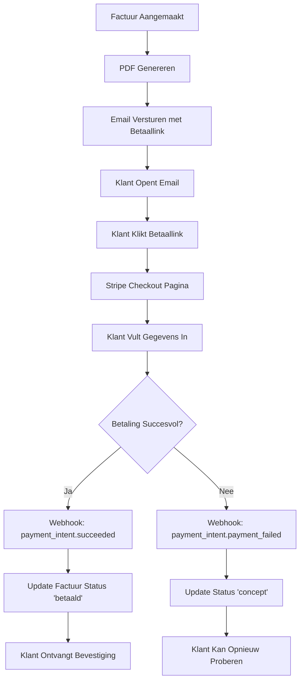

# Invoice & Payment Edge Functions

Deze functies beheren facturen, betalingen en Stripe integratie.

---

## 1. generate-invoice-pdf

**Bestand:** `supabase/functions/generate-invoice-pdf/index.ts`

### Beschrijving
Genereert professionele PDF facturen met Puppeteer.

### Kenmerken
- A4 formaat met print optimization
- Bedrijfslogo en branding
- Gedetailleerde factuurlijnen
- BTW berekeningen
- Betaalinstructies
- Opslag in Supabase Storage

### Request Parameters
```typescript
{
  invoiceId: string;                 // UUID van factuur
}
```

### Response
```typescript
{
  success: boolean;
  pdfUrl: string;                    // Publieke URL van PDF
  pdfData: string;                   // Base64 encoded PDF
  filename: string;                  // Bestandsnaam
  contentType: string;               // 'application/pdf'
  message: string;
}
```

### Environment Variables
- `SUPABASE_URL` - Supabase project URL
- `SUPABASE_SERVICE_ROLE_KEY` - Supabase service role key

### Template Features
- Company header met logo
- Factuurdetails (nummer, datum, vervaldatum)
- Van/Aan addressen
- Itemized line items table
- Subtotaal, BTW en totaal
- Betaalinstructies met IBAN
- Footer met bedrijfsinfo

---

## 2. create-invoice-payment

**Bestand:** `supabase/functions/create-invoice-payment/index.ts`

### Beschrijving
Creëert Stripe Checkout sessie voor factuur betaling.

### Kenmerken
- Stripe Live Key integratie
- Automatische klant aanmaak/lookup
- Checkout sessie met metadata
- Payment intent tracking
- Automatische URL opslag

### Request Parameters
```typescript
{
  invoice_id: string;                // UUID van factuur
}
```

### Response
```typescript
{
  url: string;                       // Stripe Checkout URL
}
```

### Environment Variables
- `STRIPE_LIVE_KEY` - Stripe secret key (sk_live_...)
- `SUPABASE_URL` - Supabase project URL
- `SUPABASE_SERVICE_ROLE_KEY` - Supabase service role key

### Checkout Features
- iDEAL, creditcard, bancontact support
- Success/cancel URLs met parameters
- Invoice metadata in payment intent
- Automatic invoice linking

---

## 3. stripe-webhook

**Bestand:** `supabase/functions/stripe-webhook/index.ts`

### Beschrijving
Webhook endpoint voor Stripe payment events.

### Kenmerken
- Signature verification
- Multiple event types ondersteuning
- Automatische status updates
- Payment record creation
- Error handling en logging

### Event Types
- `checkout.session.completed` - Checkout afgerond
- `payment_intent.succeeded` - Betaling geslaagd
- `payment_intent.payment_failed` - Betaling mislukt
- `payment_link.payment_succeeded` - Payment link betaling geslaagd
- `invoice.payment_succeeded` - Stripe invoice betaald

### Webhook Payload
Stripe stuurt automatisch webhook events naar deze endpoint.

### Environment Variables
- `STRIPE_LIVE_KEY` - Stripe secret key
- `STRIPE_WEBHOOK_SECRET` - Webhook signing secret
- `SUPABASE_URL` - Supabase project URL
- `SUPABASE_SERVICE_ROLE_KEY` - Supabase service role key

### Database Updates
```sql
-- Invoice status update bij succesvolle betaling
UPDATE invoices SET
  status = 'betaald',
  payment_status = 'paid',
  payment_date = NOW(),
  payment_method = 'stripe',
  stripe_payment_intent_id = '...'
WHERE id = invoice_id;
```

---

## 4. stripe-config-test

**Bestand:** `supabase/functions/stripe-config-test/index.ts`

### Beschrijving
Test Stripe configuratie en API connectiviteit.

### Kenmerken
- API key validatie
- Account informatie ophalen
- Balance check
- Product/price lijst
- Webhook secret check
- Gedetailleerde logging

### Request Parameters
Geen parameters nodig (authenticated request).

### Response
```typescript
{
  success: boolean;
  account: {
    id: string;
    display_name: string;
    country: string;
    business_type: string;
    email: string;
  };
  webhookConfigured: boolean;
  balance: {
    available: number;
    currency: string;
  };
  products: Array<{
    id: string;
    name: string;
    active: boolean;
  }>;
  prices: Array<{
    id: string;
    unit_amount: number;
    currency: string;
    type: string;
  }>;
  testDate: string;
}
```

### Environment Variables
- `STRIPE_LIVE_KEY` - Stripe secret key
- `STRIPE_WEBHOOK_SECRET` - Webhook secret (optioneel)
- `SUPABASE_URL` - Supabase project URL
- `SUPABASE_SERVICE_ROLE_KEY` - Supabase service role key

### Validaties
- Key format check (sk_live_ of sk_test_)
- Geen publishable keys toegestaan (pk_)
- Account connectivity test
- Balance retrieval test

---

## 5. generate-email-template

**Bestand:** `supabase/functions/generate-email-template/index.ts`

### Beschrijving
Genereert email templates met AI voor verschillende zakelijke doeleinden.

### Kenmerken
- AI-gegenereerde templates
- Nederlandse taal
- Professionele structuur
- Variabele placeholders
- JSON output format

### Request Parameters
```typescript
{
  prompt: string;                    // Beschrijving van gewenste template
}
```

### Response
```typescript
{
  template: {
    name: string;                    // Template naam
    subject: string;                 // Email onderwerp
    body_text: string;               // Email body met [Variabelen]
  }
}
```

### Environment Variables
- `OPENAI_API_KEY` - OpenAI API sleutel

### Template Variabelen
Templates gebruiken placeholders zoals:
- `[Naam]` - Ontvanger naam
- `[Bedrijf]` - Bedrijfsnaam
- `[Datum]` - Datum
- `[Project]` - Project naam
- `[Bedrag]` - Bedrag
- Etc.

---

## Payment Flow



---

## Gebruik Voorbeelden

### PDF Genereren
```typescript
const { data } = await supabase.functions.invoke('generate-invoice-pdf', {
  body: { invoiceId: 'uuid-here' }
});

console.log('PDF URL:', data.pdfUrl);
```

### Betaallink Creëren
```typescript
const { data } = await supabase.functions.invoke('create-invoice-payment', {
  body: { invoice_id: 'uuid-here' }
});

console.log('Betaallink:', data.url);
```

### Stripe Config Testen
```typescript
const { data } = await supabase.functions.invoke('stripe-config-test', {
  body: {}
});

if (data.success) {
  console.log('Stripe account:', data.account.display_name);
  console.log('Balance:', data.balance.available / 100, data.balance.currency);
}
```

### Email Template Genereren
```typescript
const { data } = await supabase.functions.invoke('generate-email-template', {
  body: {
    prompt: 'Een vriendelijke herinnering voor een openstaande factuur'
  }
});

console.log('Template:', data.template);
```

---

## Stripe Setup

### 1. API Keys
```bash
# Test mode keys
STRIPE_TEST_KEY=sk_test_...
STRIPE_TEST_WEBHOOK_SECRET=whsec_...

# Live mode keys (productie)
STRIPE_LIVE_KEY=sk_live_...
STRIPE_WEBHOOK_SECRET=whsec_...
```

### 2. Webhook Endpoint Setup
```
URL: https://[your-project].supabase.co/functions/v1/stripe-webhook
Events: 
  - checkout.session.completed
  - payment_intent.succeeded
  - payment_intent.payment_failed
  - payment_link.payment_succeeded
```

### 3. Payment Methods
Enable in Stripe Dashboard:
- iDEAL (Nederland)
- Cards (Visa, Mastercard, Amex)
- Bancontact (België)
- SEPA Direct Debit

---

## Best Practices

1. **Testing**: Gebruik altijd test mode keys tijdens development
2. **Webhooks**: Verify webhook signatures voor beveiliging
3. **Idempotency**: Implementeer idempotency keys voor payment creation
4. **Error Handling**: Log alle Stripe errors voor debugging
5. **Customer Management**: Hergebruik Stripe customers voor repeat payments
6. **Metadata**: Gebruik metadata voor invoice tracking
7. **Currency**: Consistent EUR gebruiken voor Nederlandse markt
8. **VAT**: Correcte BTW berekeningen (21% standaard tarief)

