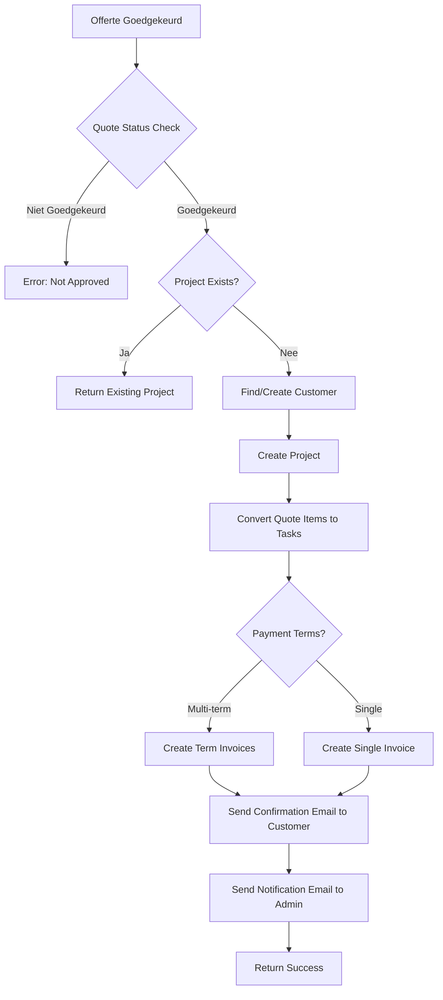
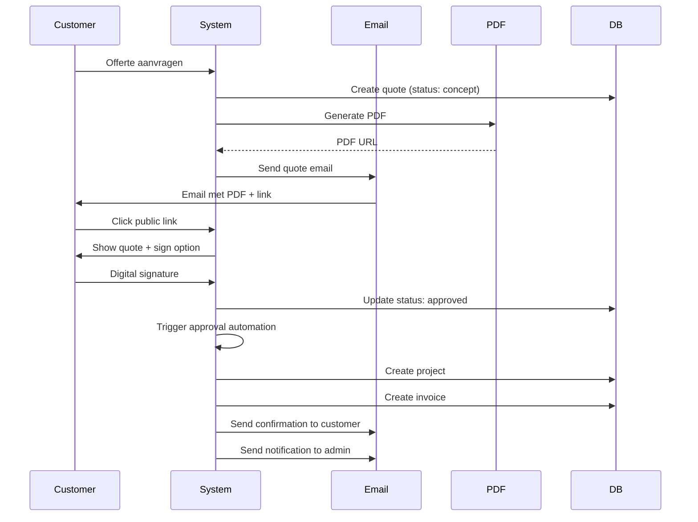

# Quote (Offerte) Edge Functions

Deze functies beheren offertes, PDF generatie, en automatisering van goedkeuringsprocessen.

---

## 1. generate-quote-pdf

**Bestand:** `supabase/functions/generate-quote-pdf/index.ts`

### Beschrijving
Genereert professionele PDF offertes met Puppeteer inclusief handtekeningen.

### Kenmerken
- A4 formaat met responsive design
- Support voor blocks structuur (producten + tekstblokken)
- Digitale handtekeningen (klant + admin)
- Automatische totaalberekeningen
- BTW berekeningen per item
- Opslag in Supabase Storage

### Request Parameters
```typescript
{
  quoteId: string;                   // UUID van offerte
  includeSigned?: boolean;           // Include handtekeningen (optioneel)
}
```

### Response
```typescript
{
  success: boolean;
  pdfUrl: string;                    // Publieke URL van PDF
  pdfData: string;                   // Base64 encoded PDF
  filename: string;                  // Bestandsnaam (offerte-{nummer}.pdf)
  contentType: string;               // 'application/pdf'
  message: string;
}
```

### Environment Variables
- `SUPABASE_URL` - Supabase project URL
- `SUPABASE_SERVICE_ROLE_KEY` - Supabase service role key

### PDF Structuur
```
┌─────────────────────────────────┐
│ Header (Logo + OFFERTE titel)   │
├─────────────────────────────────┤
│ Van/Aan Addressen               │
├─────────────────────────────────┤
│ Offerte Details (datum, geldig) │
├─────────────────────────────────┤
│ Bericht (optioneel)             │
├─────────────────────────────────┤
│ OFFERTEONDERDELEN               │
│  ┌─────────────────────────┐   │
│  │ Product Block 1         │   │
│  │  - Items table          │   │
│  │  - Subtotaal + BTW      │   │
│  └─────────────────────────┘   │
│  ┌─────────────────────────┐   │
│  │ Tekstblok               │   │
│  └─────────────────────────┘   │
├─────────────────────────────────┤
│ Grand Totals                    │
├─────────────────────────────────┤
│ Handtekeningen (indien van      │
│ toepassing)                     │
├─────────────────────────────────┤
│ Footer (voorwaarden, contact)  │
└─────────────────────────────────┘
```

---

## 2. quote-approval-automation

**Bestand:** `supabase/functions/quote-approval-automation/index.ts`

### Beschrijving
Automatiseert het hele proces na offerte goedkeuring: project aanmaken, factuur genereren, emails versturen.

### Kenmerken
- Automatische project aanmaak
- Klant aanmaken/vinden
- Concept factuur generatie
- Support voor payment terms (termijnfacturen)
- Taken genereren vanuit offerte items
- Automatische email notificaties
- Status updates

### Request Parameters
```typescript
{
  quote_id: string;                  // UUID van goedgekeurde offerte
}
```

### Response
```typescript
{
  success: boolean;
  project_id: string;                // Nieuw project ID
  invoice_id: string;                // Nieuw concept factuur ID (of eerste termijn)
  message: string;
}
```

### Environment Variables
- `SUPABASE_URL` - Supabase project URL
- `SUPABASE_SERVICE_ROLE_KEY` - Supabase service role key

### Automation Flow


### Database Changes
1. **Customer**: Aangemaakt of gevonden op basis van naam + email
2. **Project**: 
   - Status: 'te-plannen'
   - Linked to quote_id
   - Value: quote total_amount
3. **Project Tasks**: Gegenereerd vanuit quote items met block structuur
4. **Invoice(s)**: 
   - Status: 'concept'
   - Linked to quote
   - Items gekopieerd van quote
   - Bij payment terms: meerdere facturen met sequence numbers

### Payment Terms Support
Als offerte payment_terms heeft:
```json
[
  { "percentage": 40, "description": "Aanbetaling", "daysAfter": 0 },
  { "percentage": 30, "description": "Bij start", "daysAfter": 7 },
  { "percentage": 30, "description": "Bij oplevering", "daysAfter": 30 }
]
```
Worden automatisch 3 facturen gegenereerd met juiste bedragen en vervaldatums.

---

## 3. apply-quote-migration

**Bestand:** `supabase/functions/apply-quote-migration/index.ts`

### Beschrijving
Database migratie functie voor quote numbering systeem met advisory locking.

### Kenmerken
- Advisory locking voor thread safety
- Duplicate detection en fixing
- Automatische quote nummer generatie
- Jaar-gebaseerde nummering (OFF-YYYY-NNNN)

### Request Parameters
Geen parameters nodig.

### Response
```typescript
{
  success: boolean;
  message: string;
  testQuoteNumber: string;           // Test generated number
  timestamp: string;
}
```

### Environment Variables
- `SUPABASE_URL` - Supabase project URL
- `SUPABASE_SERVICE_ROLE_KEY` - Supabase service role key

### Generated Functions
```sql
-- Generate unique quote number
CREATE FUNCTION generate_quote_number() RETURNS text

-- Fix duplicate quote numbers
CREATE FUNCTION fix_duplicate_quote_numbers()
  RETURNS TABLE(old_quote_number text, new_quote_number text, quote_id uuid)
```

### Quote Number Format
```
OFF-{YEAR}-{SEQUENCE}
OFF-2025-0001
OFF-2025-0002
...
OFF-2025-9999
```

---

## 4. generate-completion-pdf

**Bestand:** `supabase/functions/generate-completion-pdf/index.ts`

### Beschrijving
Genereert werkrapport PDF bij project afronding met foto's en handtekeningen.

### Kenmerken
- Project completion rapport
- Foto's van uitgevoerd werk
- Digitale handtekeningen (klant + monteur)
- Klanttevredenheid weergave (sterren)
- Uitgevoerde werkzaamheden
- Aanbevelingen
- Materiaal lijst

### Request Parameters
```typescript
{
  completionData: {
    project_id: string;
    installer_id: string;
    completion_date: string;
    work_performed: string;
    materials_used?: string;
    recommendations?: string;
    notes?: string;
    customer_satisfaction: number;     // 1-5
    customer_signature: string;
    installer_signature: string;
    photos: Array<{
      id: string;
      url: string;
      description: string;
      category: string;                // 'before' | 'during' | 'after'
    }>;
  }
}
```

### Response
```typescript
{
  success: boolean;
  completion_id: string;               // Database completion record ID
  pdf_url: string;                     // PDF URL
  email_sent: boolean;                 // Email naar klant verstuurd
  message: string;
}
```

### Environment Variables
- `SUPABASE_URL` - Supabase project URL
- `SUPABASE_SERVICE_ROLE_KEY` - Supabase service role key

### Automatic Actions
1. Completion record opslaan in database
2. Foto's linken aan completion
3. PDF genereren en uploaden
4. Email versturen naar klant (via send-completion-email)
5. Project status updaten naar 'Afgerond'

---

## Gebruik Voorbeelden

### Offerte PDF Genereren
```typescript
const { data } = await supabase.functions.invoke('generate-quote-pdf', {
  body: { quoteId: 'uuid-here' }
});

console.log('Quote PDF:', data.pdfUrl);
```

### Offerte Goedkeuring Verwerken
```typescript
// Deze wordt automatisch aangeroepen bij client signature
const { data } = await supabase.functions.invoke('quote-approval-automation', {
  body: { quote_id: 'uuid-here' }
});

console.log('Project ID:', data.project_id);
console.log('Invoice ID:', data.invoice_id);
```

### Project Afronden
```typescript
const { data } = await supabase.functions.invoke('generate-completion-pdf', {
  body: {
    completionData: {
      project_id: 'uuid',
      installer_id: 'uuid',
      completion_date: '2025-10-01',
      work_performed: 'Kozijnen geplaatst en afgewerkt',
      customer_satisfaction: 5,
      customer_signature: 'signature-data-url',
      installer_signature: 'signature-data-url',
      photos: [
        {
          id: '1',
          url: 'https://...',
          description: 'Voor installatie',
          category: 'before'
        }
      ]
    }
  }
});
```

---

## Quote Workflow



---

## Best Practices

1. **Numbering**: Gebruik altijd generate_quote_number() voor nieuwe offertes
2. **Blocks**: Gebruik moderne blocks structuur voor flexibiliteit
3. **Signatures**: Valideer signature data voordat offerte wordt goedgekeurd
4. **PDF Generation**: Cache PDFs waar mogelijk, regenereer alleen bij wijzigingen
5. **Public Tokens**: Genereer en bewaar tokens voor publieke offerte links
6. **Status Flow**: Concept → Sent → Approved → Project Created
7. **Email Timing**: Verstuur confirmation email direct na goedkeuring
8. **Payment Terms**: Gebruik termijnen voor grote projecten (>€5000)
9. **Task Generation**: Behoud block structuur in project taken voor overzicht
10. **Testing**: Test approval automation grondig in development

