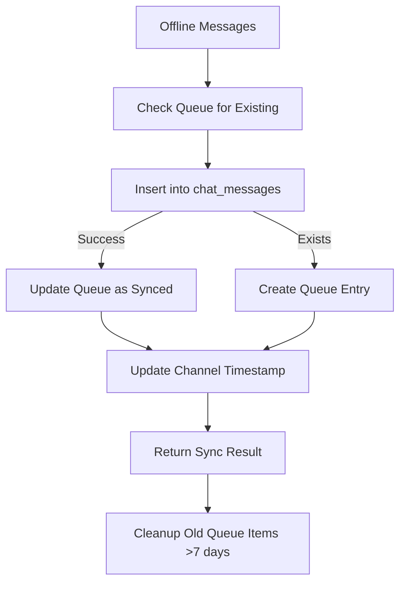

# Chat & Communication Edge Functions

Deze functies beheren chat berichten, AI assistentie, analytics en synchronisatie.

---

## 1. chat-ai-assistant

**Bestand:** `supabase/functions/chat-ai-assistant/index.ts`

### Beschrijving
Context-aware AI assistant voor chat berichten met intelligente antwoord suggesties.

### Kenmerken
- OpenAI GPT-3.5-turbo integratie
- Context van project, klant en gesprek
- Message classification integratie
- Smart reply generation
- Confidence scoring
- Contextual info en recommended actions

### Request Parameters
```typescript
{
  message: string;                   // User message
  classification: {
    intent: string;                  // Message intent
    urgency: string;                 // low | medium | high | critical
    topics: string[];                // Conversation topics
    entities: Record<string, any>;   // Extracted entities
    sentiment: string;               // positive | neutral | negative
    confidence: number;              // 0-1
  };
  context: {
    currentProject?: {
      id: string;
      title: string;
      status: string;
      tasks: Array<{
        id: string;
        description: string;
        completed: boolean;
      }>;
      materials: Array<{
        name: string;
        quantity: number;
        status: string;
      }>;
    };
    customer?: {
      id: string;
      name: string;
      email: string;
    };
    conversationSummary: {
      totalMessages: number;
      commonTopics: string[];
      recentActions: string[];
      unresolved_issues: string[];
    };
  };
  userRole: string;                  // User role in system
  language: string;                  // nl, en, etc.
}
```

### Response
```typescript
{
  suggestions: Array<{
    id: string;
    text: string;                    // Suggested reply text
    confidence: number;              // 0-1
    type: 'ai_generated';
    metadata: {
      reasoning: string;             // Why this suggestion
      context_used: string[];        // What context was used
    };
  }>;
  classification: object;            // Echo of input classification
  contextualInfo: string[];          // Contextual information
  recommendedActions: Array<{
    type: string;                    // escalate | follow_up | etc.
    description: string;
    data: object;
  }>;
}
```

### Environment Variables
- `OPENAI_API_KEY` - OpenAI API sleutel
- `SUPABASE_URL` - Supabase project URL
- `SUPABASE_SERVICE_ROLE_KEY` - Supabase service role key

### AI Features
- **Context Building**: Gebruikt project, klant en gesprek context
- **Intent Recognition**: Reageert op urgency en intent
- **Actionable Suggestions**: Genereert praktische antwoorden
- **Classification Storage**: Slaat classificaties op voor learning
- **Escalation Logic**: Suggests escalatie bij critical urgency
- **Follow-up Tracking**: Recommends follow-up actions

---

## 2. chat-analytics

**Bestand:** `supabase/functions/chat-analytics/index.ts`

### Beschrijving
Genereert analytics en insights voor chat conversaties.

### Kenmerken
- Multiple analytics types (conversation, user, project, system)
- Trend analysis
- Metrics calculation
- Insight generation met recommendations
- Timeframe filtering (day, week, month, quarter, year)

### Request Parameters
```typescript
{
  type: 'conversation' | 'user' | 'project' | 'system';
  timeframe: 'day' | 'week' | 'month' | 'quarter' | 'year';
  filters?: {
    userIds?: string[];
    projectIds?: string[];
    languages?: string[];
  };
}
```

### Response
```typescript
{
  metrics: Record<string, number>;   // Key metrics
  trends: Array<{
    date: string;
    value: number;
  }>;
  insights: Array<{
    type: 'positive' | 'negative' | 'neutral';
    title: string;
    description: string;
    impact: 'low' | 'medium' | 'high';
    recommendations: string[];
  }>;
}
```

### Conversation Metrics
- Total messages
- Unique conversations
- Average message length
- Translated messages count
- Voice messages count
- File/image messages count
- Daily message trends

### System Metrics
- Total system messages
- New users in timeframe
- Average messages per day
- Language distribution
- System health indicators

### Generated Insights
- Translation usage patterns
- Voice communication engagement
- Message length analysis
- System adoption indicators
- User activity trends

### Environment Variables
- `SUPABASE_URL` - Supabase project URL
- `SUPABASE_SERVICE_ROLE_KEY` - Supabase service role key

---

## 3. message-sync

**Bestand:** `supabase/functions/message-sync/index.ts`

### Beschrijving
Synchroniseert offline chat berichten naar de database.

### Kenmerken
- Batch synchronisatie
- Duplicate prevention via temp_id
- Offline queue management
- Channel timestamp updates
- Auto cleanup van oude synced messages
- Per-message error handling

### Request Parameters
```typescript
{
  messages: Array<{
    temp_id: string;                 // Temporary offline ID
    channel_id: string;              // Channel UUID
    content: string;                 // Message content
    message_type: 'text' | 'image' | 'file' | 'voice';
    file_url?: string;
    file_name?: string;
    created_at: string;              // ISO timestamp
  }>;
}
```

### Response
```typescript
{
  success: boolean;
  synced_count: number;              // Successfully synced
  failed_count: number;              // Failed to sync
  results: Array<{
    temp_id: string;
    message_id?: string;             // New DB message ID
    success: boolean;
    error?: string;
  }>;
}
```

### Environment Variables
- `SUPABASE_URL` - Supabase project URL
- `SUPABASE_SERVICE_ROLE_KEY` - Supabase service role key

### Sync Logic


---

## 4. notification-processor

**Bestand:** `supabase/functions/notification-processor/index.ts`

### Beschrijving
Verwerkt en verstuurt push notificaties naar gebruikers en kanalen.

### Kenmerken
- Multiple notification types
- FCM (Firebase Cloud Messaging) integratie
- Push subscription management
- Batch notificatie verzending
- Platform-specific payloads (Android, iOS)
- User notification preferences check
- Delivery logging

### Request Types

#### Register Push Subscription
```typescript
{
  type: 'register_push_subscription';
  subscription: {
    endpoint: string;
    keys: {
      p256dh: string;
      auth: string;
    };
  };
  user_id: string;
}
```

#### Push Notification
```typescript
{
  type: 'push_notification';
  payload: {
    title: string;
    body: string;
    type?: string;
    data?: Record<string, any>;
    priority?: 'high' | 'normal' | 'low';
    actionUrl?: string;
  };
  user_id?: string;                  // Specific user or broadcast
}
```

#### Chat Message Notification
```typescript
{
  type: 'chat_message_notification';
  payload: {
    channel_id: string;
    message_id: string;
    sender_name: string;
    content: string;
  };
}
```

### Response
```typescript
{
  success: boolean;
  sent?: number;                     // Number of notifications sent
  failed?: number;                   // Number failed
  total?: number;                    // Total attempted
  message?: string;
}
```

### Environment Variables
- `FCM_SERVER_KEY` - Firebase Cloud Messaging server key
- `SUPABASE_URL` - Supabase project URL
- `SUPABASE_SERVICE_ROLE_KEY` - Supabase service role key

### FCM Payload Structure
```json
{
  "registration_ids": ["token1", "token2"],
  "notification": {
    "title": "Nieuw bericht",
    "body": "Je hebt een nieuw bericht ontvangen",
    "icon": "ic_notification",
    "sound": "default"
  },
  "data": {
    "type": "chat_message",
    "actionUrl": "/chat?channel=...",
    "timestamp": "2025-10-01T10:00:00Z"
  },
  "priority": "high",
  "android": { ... },
  "apns": { ... }
}
```

---

## 5. send-push-notification

**Bestand:** `supabase/functions/send-push-notification/index.ts`

### Beschrijving
Verstuurt push notificaties naar meerdere gebruikers met FCM.

### Kenmerken
- Multi-user targeting
- Broadcast support
- User notification settings check
- RPC functions voor settings en tokens
- Platform-specific customization
- Delivery tracking en logging

### Request Parameters
```typescript
{
  userIds?: string[];                // Target user IDs
  sendToAll?: boolean;               // Broadcast to all active users
  notification: {
    title: string;
    body: string;
    type?: string;                   // Notification type
    data?: Record<string, any>;      // Custom data payload
    priority?: 'high' | 'normal' | 'low';
    actionUrl?: string;              // Deep link URL
  };
}
```

### Response
```typescript
{
  success: boolean;
  message: string;
  totalUsers: number;
  results: Array<{
    userId: string;
    success: boolean;
    tokensCount?: number;
    fcmResult?: object;
    error?: string;
  }>;
}
```

### Environment Variables
- `FCM_SERVER_KEY` - Firebase Cloud Messaging server key
- `SUPABASE_URL` - Supabase project URL
- `SUPABASE_SERVICE_ROLE_KEY` - Supabase service role key

### Required Database Functions
```sql
-- Check if user should receive notification
should_send_notification(target_user_id uuid, notification_type text) 
  RETURNS boolean

-- Get user's active push tokens
get_user_push_tokens(target_user_id uuid) 
  RETURNS TABLE(token text, platform text, device_id text)
```

---

## Gebruik Voorbeelden

### AI Chat Assistant
```typescript
const { data } = await supabase.functions.invoke('chat-ai-assistant', {
  body: {
    message: "Wanneer wordt het project opgeleverd?",
    classification: {
      intent: "question",
      urgency: "medium",
      topics: ["project", "timeline"],
      entities: {},
      sentiment: "neutral",
      confidence: 0.8
    },
    context: {
      currentProject: {
        id: "uuid",
        title: "Kozijnen Jansen",
        status: "In Progress",
        tasks: [...]
      }
    },
    userRole: "customer",
    language: "nl"
  }
});

// data.suggestions = [{ text: "Het project...", confidence: 0.9, ... }]
```

### Chat Analytics
```typescript
const { data } = await supabase.functions.invoke('chat-analytics', {
  body: {
    type: 'conversation',
    timeframe: 'month',
    filters: {
      userIds: ['user-uuid']
    }
  }
});

console.log('Metrics:', data.metrics);
console.log('Insights:', data.insights);
```

### Offline Message Sync
```typescript
const offlineMessages = [
  {
    temp_id: 'offline-1',
    channel_id: 'channel-uuid',
    content: 'Test message',
    message_type: 'text',
    created_at: new Date().toISOString()
  }
];

const { data } = await supabase.functions.invoke('message-sync', {
  body: { messages: offlineMessages }
});
```

### Push Notification
```typescript
const { data } = await supabase.functions.invoke('send-push-notification', {
  body: {
    userIds: ['user-uuid-1', 'user-uuid-2'],
    notification: {
      title: 'Project Update',
      body: 'Je project is gestart!',
      type: 'project_update',
      priority: 'high',
      actionUrl: '/projects/uuid'
    }
  }
});
```

---

## Best Practices

1. **AI Context**: Verstrek altijd maximale context voor betere AI suggesties
2. **Analytics**: Run analytics periodiek voor insights, niet real-time
3. **Message Sync**: Batch offline messages voor efficiency
4. **Push Tokens**: Clean up expired tokens regelmatig
5. **Notification Settings**: Respecteer user notification preferences
6. **Error Handling**: Log failed notifications voor retry logic
7. **Rate Limiting**: Implementeer rate limiting voor push notifications
8. **Personalization**: Gebruik user context in notificaties
9. **Testing**: Test push notifications op beide platforms (iOS, Android)
10. **Privacy**: Filter sensitive data uit notification payloads

