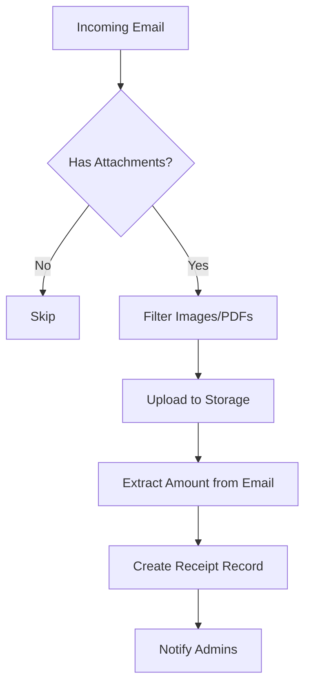

# Overige Edge Functions

Deze functies beheren authentication, calendar sync, receipts, en webhooks.

---

## Authentication & Mobile

### 1. auth-mobile

**Bestand:** `supabase/functions/auth-mobile/index.ts`

#### Beschrijving
Mobile authentication endpoint voor sign-in.

#### Kenmerken
- Email/password authentication
- Error handling met Nederlandse berichten
- CORS support
- Mobile-optimized responses

#### Request Parameters
```typescript
{
  email: string;
  password: string;
}
```

#### Response
```typescript
{
  user: object;
  session: object;
  error?: string;
}
```

#### Environment Variables
- `SUPABASE_URL` - Supabase project URL
- `SUPABASE_ANON_KEY` - Supabase anon key

---

### 2. customers-mobile

**Bestand:** `supabase/functions/customers-mobile/index.ts`

#### Beschrijving
Volledige CRUD API voor klanten management via mobiele app.

#### Kenmerken
- RESTful endpoints (GET, POST, PUT, DELETE)
- Rate limiting (100 requests per minute)
- Input validation en sanitization
- UUID validation
- RLS (Row Level Security) enforcement
- Comprehensive error handling

#### Endpoints

**GET /customers-mobile** - Alle klanten ophalen
```typescript
// Response
[
  {
    id: string;
    name: string;
    email: string;
    phone?: string;
    address?: string;
    company?: string;
    created_at: string;
  }
]
```

**GET /customers-mobile/{id}** - Enkele klant ophalen
```typescript
// Response
{
  id: string;
  name: string;
  email: string;
  phone?: string;
  address?: string;
  company?: string;
}
```

**POST /customers-mobile** - Klant aanmaken
```typescript
// Request
{
  name: string;              // Required, max 255 chars
  email: string;             // Required, valid email format
  phone?: string;            // Optional, max 50 chars
  address?: string;          // Optional, max 500 chars
  company?: string;          // Optional, max 255 chars
}
```

**PUT /customers-mobile/{id}** - Klant updaten
```typescript
// Request (all fields optional)
{
  name?: string;
  email?: string;
  phone?: string;
  address?: string;
  company?: string;
}
```

**DELETE /customers-mobile/{id}** - Klant verwijderen

#### Validation Rules
- Name: niet leeg, max 255 chars
- Email: valid email format, lowercase, max 255 chars
- Phone: max 50 chars
- Address: max 500 chars
- Company: max 255 chars
- Alle strings worden getrimmed

#### Environment Variables
- `SUPABASE_URL` - Supabase project URL
- `SUPABASE_ANON_KEY` - Supabase anon key

---

## Calendar & Integration

### 3. google-calendar-auth

**Bestand:** `supabase/functions/google-calendar-auth/index.ts`

#### Beschrijving
Google Calendar OAuth2 authenticatie flow.

#### Kenmerken
- OAuth2 authorization code flow
- Token refresh handling
- Secure credential storage
- User info retrieval

#### Actions

**start_oauth** - Start OAuth flow
```typescript
// Request
{ action: 'start_oauth' }

// Response
{ authUrl: string }  // Redirect user to this URL
```

**exchange_code** - Exchange auth code for tokens
```typescript
// Request
{
  action: 'exchange_code';
  code: string;              // OAuth authorization code
}

// Response
{
  success: boolean;
  message: string;
  userInfo: {
    email: string;
    name: string;
  }
}
```

**refresh_token** - Refresh access token
```typescript
// Request
{
  action: 'refresh_token';
  refresh_token: string;
}

// Response
{
  access_token: string;
  expires_in: number;
}
```

#### Environment Variables
- `GOOGLE_CLIENT_ID` - Google OAuth client ID
- `GOOGLE_CLIENT_SECRET` - Google OAuth client secret
- `SITE_URL` - Site URL for redirect URI
- `SUPABASE_URL` - Supabase project URL
- `SUPABASE_SERVICE_ROLE_KEY` - Supabase service role key

---

### 4. google-calendar-sync

**Bestand:** `supabase/functions/google-calendar-sync/index.ts`

#### Beschrijving
Google Calendar events synchronisatie.

#### Kenmerken
- Event CRUD operations
- Multiple calendar support
- Date range filtering
- Recurring events support

#### Actions

**create_event** - Nieuwe event aanmaken
```typescript
// Request
{
  action: 'create_event';
  access_token: string;
  event: {
    summary: string;
    description?: string;
    start: {
      dateTime: string;      // ISO 8601
      timeZone?: string;
    };
    end: {
      dateTime: string;
      timeZone?: string;
    };
    attendees?: Array<{ email: string }>;
    reminders?: object;
  }
}
```

**update_event** - Event updaten
```typescript
// Request
{
  action: 'update_event';
  access_token: string;
  event_id: string;
  updates: object;           // Partial event object
}
```

**delete_event** - Event verwijderen
```typescript
// Request
{
  action: 'delete_event';
  access_token: string;
  event_id: string;
}
```

**get_events** - Events ophalen
```typescript
// Request
{
  action: 'get_events';
  access_token: string;
  timeMin?: string;          // ISO 8601 (default: now)
  timeMax?: string;          // ISO 8601 (default: +30 days)
}

// Response
{
  success: boolean;
  events: Array<object>;     // Google Calendar event objects
}
```

**get_calendars** - Calendars ophalen
```typescript
// Request
{
  action: 'get_calendars';
  access_token: string;
}

// Response
{
  success: boolean;
  calendars: Array<object>;
}
```

#### Environment Variables
Geen environment variables nodig (gebruikt runtime parameters).

---

## Receipt Management

### 5. receipt-processor

**Bestand:** `supabase/functions/receipt-processor/index.ts`

#### Beschrijving
Verwerkt incoming email receipts met attachments.

#### Kenmerken
- Email parsing
- Image extraction
- Storage upload
- Amount extraction (regex)
- Admin notifications
- Database record creation

#### Request Parameters
```typescript
{
  from: string;              // Sender email
  subject: string;           // Email subject
  messageId: string;         // Email message ID
  attachments: Array<{
    filename: string;
    content: string;         // Base64 encoded
    contentType: string;
  }>;
  textContent?: string;
  htmlContent?: string;
}
```

#### Response
```typescript
{
  success: boolean;
  message: string;
  attachmentsProcessed: number;
}
```

#### Environment Variables
- `SUPABASE_URL` - Supabase project URL
- `SUPABASE_SERVICE_ROLE_KEY` - Supabase service role key

#### Processing Flow


---

### 6. receipt-approval

**Bestand:** `supabase/functions/receipt-approval/index.ts`

#### Beschrijving
Goedkeuren of afwijzen van bonnetjes.

#### Kenmerken
- Approve/reject actions
- User assignment
- Email notifications naar indiener
- Admin notifications
- Status tracking

#### Request Parameters
```typescript
{
  receiptId: string;
  action: 'approve' | 'reject';
  reason?: string;           // Required for reject
  userId?: string;           // Assign to user (on approve)
}
```

#### Response
```typescript
{
  success: boolean;
  message: string;
  receipt: object;           // Updated receipt object
}
```

#### Environment Variables
- `RESEND_API_KEY` - Resend API key for emails
- `SUPABASE_URL` - Supabase project URL
- `SUPABASE_ANON_KEY` - Supabase anon key

---

## Webhook Management

### 7. webhook-processor

**Bestand:** `supabase/functions/webhook-processor/index.ts`

#### Beschrijving
Verstuurt webhooks naar externe systemen en broadcast events.

#### Kenmerken
- HMAC signature generation
- Webhook delivery logging
- Event broadcasting
- Error handling en retry
- Multiple webhook endpoints support

#### Actions

**send_webhook** - Verstuur naar specifieke webhook
```typescript
// Request
{
  type: 'send_webhook';
  webhook_id: string;
  event: {
    type: string;
    data: any;
    timestamp: string;
    source: string;
  }
}
```

**broadcast_event** - Broadcast naar alle matching webhooks
```typescript
// Request
{
  type: 'broadcast_event';
  event_type: string;
  event_data: any;
  user_id?: string;          // Filter by user
}

// Response
{
  success: boolean;
  sent: number;
  failed: number;
  total: number;
  event_type: string;
}
```

#### Webhook Payload Format
```json
{
  "id": "uuid",
  "event_type": "quote.approved",
  "data": { ... },
  "timestamp": "2025-10-01T10:00:00Z",
  "source": "flowfocus-crm",
  "webhook_id": "webhook-uuid"
}
```

#### Webhook Headers
```
Content-Type: application/json
User-Agent: FlowFocus-CRM-Webhook/1.0
X-FlowFocus-Event: {event_type}
X-FlowFocus-Delivery: {delivery-uuid}
X-FlowFocus-Timestamp: {timestamp}
X-FlowFocus-Signature: sha256={signature}
```

#### Signature Verification
```javascript
// Verify webhook signature
const crypto = require('crypto');
const signature = hmac('sha256', secretKey, payload);
const receivedSignature = headers['x-flowfocus-signature'].replace('sha256=', '');
const isValid = signature === receivedSignature;
```

#### Environment Variables
- `SUPABASE_URL` - Supabase project URL
- `SUPABASE_SERVICE_ROLE_KEY` - Supabase service role key

---

## Gebruik Voorbeelden

### Mobile Customer Management
```typescript
// Get all customers
const { data } = await fetch('/functions/v1/customers-mobile', {
  headers: { Authorization: `Bearer ${token}` }
});

// Create customer
await fetch('/functions/v1/customers-mobile', {
  method: 'POST',
  headers: {
    Authorization: `Bearer ${token}`,
    'Content-Type': 'application/json'
  },
  body: JSON.stringify({
    name: 'Jan Jansen',
    email: 'jan@email.com',
    phone: '+31612345678'
  })
});
```

### Google Calendar Sync
```typescript
// Start OAuth
const { data } = await supabase.functions.invoke('google-calendar-auth', {
  body: { action: 'start_oauth' }
});
// Redirect user to data.authUrl

// After OAuth callback
await supabase.functions.invoke('google-calendar-auth', {
  body: { 
    action: 'exchange_code',
    code: authCode 
  }
});

// Sync events
const { data: events } = await supabase.functions.invoke('google-calendar-sync', {
  body: {
    action: 'get_events',
    access_token: token,
    timeMin: new Date().toISOString(),
    timeMax: new Date(Date.now() + 30*24*60*60*1000).toISOString()
  }
});
```

### Receipt Processing
```typescript
// Approve receipt
await supabase.functions.invoke('receipt-approval', {
  body: {
    receiptId: 'uuid',
    action: 'approve',
    userId: 'assign-to-user-uuid'
  }
});

// Reject receipt
await supabase.functions.invoke('receipt-approval', {
  body: {
    receiptId: 'uuid',
    action: 'reject',
    reason: 'Onvoldoende details zichtbaar'
  }
});
```

### Webhook Broadcasting
```typescript
// Broadcast event to all webhooks
await supabase.functions.invoke('webhook-processor', {
  body: {
    type: 'broadcast_event',
    event_type: 'project.completed',
    event_data: {
      project_id: 'uuid',
      completed_at: new Date().toISOString()
    }
  }
});
```

---

## Best Practices

1. **Authentication**: Valideer altijd tokens in mobile endpoints
2. **Rate Limiting**: Implementeer rate limiting voor publieke endpoints
3. **Input Validation**: Sanitize en valideer alle user input
4. **OAuth Tokens**: Refresh tokens voordat ze expiren
5. **Calendar Sync**: Sync alleen recent/upcoming events voor performance
6. **Receipt Processing**: Filter op image/PDF types voor relevantie
7. **Webhooks**: Gebruik HMAC signatures voor security
8. **Error Handling**: Log errors met voldoende context
9. **Retry Logic**: Implementeer exponential backoff voor webhooks
10. **Testing**: Test OAuth flows grondig in development

